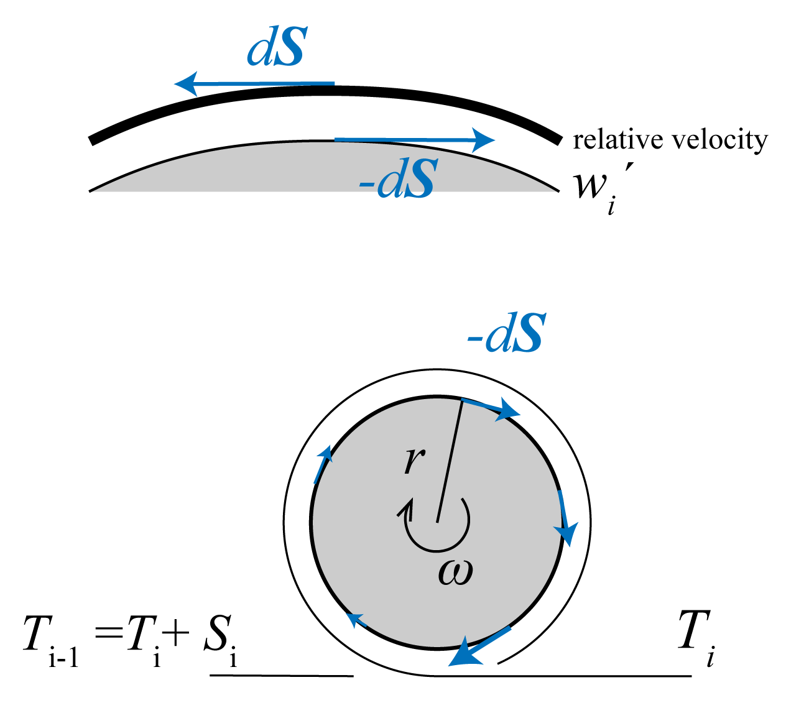
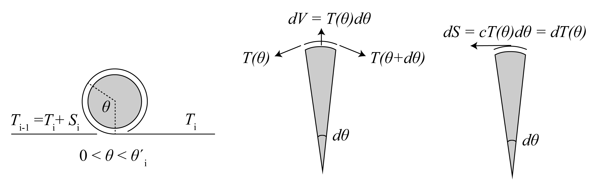
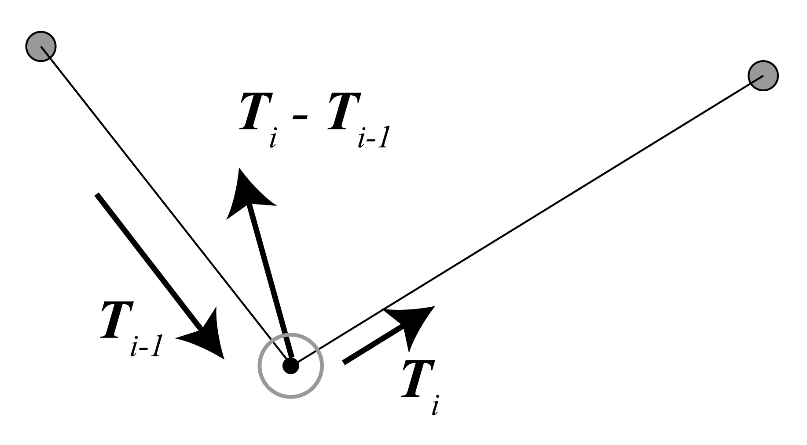

# Generalized diabolo model and analytical solution

<!-- @import "[TOC]" {cmd="toc" depthFrom=1 depthTo=6 orderedList=false} -->

<!-- code_chunk_output -->

- [Generalized diabolo model and analytical solution](#generalized-diabolo-model-and-analytical-solution)
  - [1. Definitions and Preparations](#1-definitions-and-preparations)
    - [1-1. Geometry](#1-1-geometry)
    - [1-2. Frictions](#1-2-frictions)
    - [1-2-Appendix. Capstan Equation](#1-2-appendix-capstan-equation)
    - [1-3. Equations of motions and constraints](#1-3-equations-of-motions-and-constraints)
  - [2. Solution](#2-solution)
    - [2-1. Derivation of Accelerations](#2-1-derivation-of-accelerations)
    - [2-2. Re-stating Formula for Numerical Calculation](#2-2-re-stating-formula-for-numerical-calculation)
  - [3. Loosening and Tensing Events](#3-loosening-and-tensing-events)
    - [3-1. Impulse Model](#3-1-impulse-model)

<!-- /code_chunk_output -->

## 1. Definitions and Preparations

We only consider two-dimensional motions.
We ignore the size of the diabolo axel, so that the diabolos are considered point masses.
We do consider the friction, in which the radius of the diabolo axel matters and we don't ignore it.
That is, we consider the axel radius to be negligibly small compared to the length scale of string and point mass motions,
which is usually a physically reasonable approximation.

We focus on a certain time segment in which all diabolos keep contacting the string,
without any attachment or detachment events.
The primary goal is to obtain the time-development of the system (sticks and diabolos)
for a given initial condition and input (the forces applied to sticks from hands).
As attachment/detachment events are discrete in time,
the real situation involving attachment and detachment (catch and throw)
can be treated as the sequential time segments connected by those events.
The solution we get here can easily be extended to such real situations
by having a way to detect those events and a model for flying diabolos.

### 1-1. Geometry

Let N diabolos be on the string. 
We number the objects from left to right, left stick being 0 and right stick being N+1, diabolos being 1,...,N.
With these numberings, position $\boldsymbol{x_i} \: (i=0,...,N+1)$
 and their time-differentials velocity $\boldsymbol{u_i}$ and acceleration $\boldsymbol{a_i}$ are defined.

Let $\boldsymbol{l_i}$ the string segment vector between $\boldsymbol{x_i, x_{i+1}}$, and $l_i$ the length of it.
Unit vector $\boldsymbol{e_i}$ is also defined

$$
\begin{align}
&\boldsymbol{l_i} := \boldsymbol{x_{i+1}} - \boldsymbol{x_i} \:(i=0,...,N) \\
&l_i := |\boldsymbol{l_i}| \\
&\boldsymbol{e_i} := \frac{\boldsymbol{l_i}}{l_i}
\end{align}
$$

Rotating coordinate system $(\boldsymbol{\alpha_i} , \boldsymbol{\beta_i})$ (unit vectors) is defined for each object as shown in the figure below.
Let $\phi_i$ the rotaion angle.
$\phi_i$ is determined so that $\boldsymbol{\beta_i}$ is the bisector of two adjacent string segments.
Let $\theta_i$ the angle between two adjacent string segments.
$\phi_0, \phi_{N+1}$ at the sticks are defined so that $\boldsymbol{\beta_0},\boldsymbol{\beta_{N+1}}$ is parallel to the terminal string segment.

Here, these angles have a redundancy of $2n\pi$ .
This redundancy is utilized to express the string wrapping around the axel of diabolos.
In the situation where all the diabolos are simply sitting on the string without wrapping, 
$\theta_i$ are defined so that $0 \le\theta_i < 2\pi$ .
Note that physics require $\pi \le \theta_i < 2\pi$ , since diabolos are not flying.
Additionally, define so that $0 \le \phi_0 < 2\pi$ .
Then $\phi_i \: (i=1,...,N+1)$ is intuitively defined as shown below so that you tilt the coordinates as you go from left to right.

$$
\begin{equation}
\begin{gathered}
\phi_i := \phi_{i-1} + \frac{\theta_{i-1} - \pi}{2} + \frac{\theta_{i} - \pi}{2}
= \phi_{i-1} + \psi_{i-1} + \psi_{i}
= \phi_0 -\frac{\pi}{2} - \psi_i + (2\sum_{j=1}^{i} \psi_j )\\
\text{where } \psi_i := \frac{\theta_i - \pi}{2}\\
\theta_0 , \theta_{N+1} := 0
,\; \psi_0, \psi_{N+1} = - \frac{\pi}{2}\\
\end{gathered}
\end{equation}
$$

Here defined another angle $\psi_i$ as a simple derivative of $\theta_i$.

In the time-dependent context, $0 \le \phi_0 < 2\pi$ at time 0.
Then all angles are allowed to change continuously.
The wrapping is introduced by the extension of this simple situation.
As you wrap a diabolo i, you increase $\theta_i$ from $0-2\pi$ regime to $2\pi - 4\pi$ regime.
Also $\phi_i$ increases by about $\pi$.

To provide the language, "knot degree" $k_i$ is defined:
0 for zero-wrapped state, 
1 for single-wrapped state,
2 for double-wrapped state,
and so on.
Also k is
-1 for zero-wrapped recaptured state, 
-2 for single-wrapped recaptured state,
-3 for double-wrapped recaptured state,
and so on.

Accordingly, redundancy of $\theta_i$ can be determined based on the knot degree, $2k_i\pi \le \theta_i < 2(k_i+1)\pi$

Note that $-\pi \le \theta_i < \pi$ means that the diabolo would be flying and is not physically allowed.
This "flying regime" might provide useful boundaries 
when the diabolos actually detach from and attach to the string.
Now that all $\theta_i$ and $\phi_0$ is non-arbitrarily defined, 
$\phi_i$ is also non-arbitrarily defined by the definition above.

We adopted the system where we first define $\phi_0$ and $\theta_i$ , 
then secondarily defined $\phi_i$. 
But it is also possible to first define $\phi_{0,...,N}$ , 
then secondarily define $\phi_{N+1}$ and $\theta_i$.
Also $\theta$ and $\psi$ is completely interchangeable.
There is some arbitrariness in what is chosen for the state variable.

$\boldsymbol{u_i, a_i}$ can be expressed using the rotating coordinate system $(\boldsymbol{\alpha_i}, \boldsymbol{\beta_i}) \: (i=0,...,N+1)$ .

$$
\begin{gather}
\boldsymbol{u_i} = 
u_i^{\alpha}\boldsymbol{\alpha_i} + u_i^{\beta}\boldsymbol{\beta_i} =
\begin{pmatrix} u_{i}^{\alpha} \\ u_{i}^{\beta} \end{pmatrix} =
\begin{bmatrix}
    \cos{\phi_i} & \sin{\phi_i} \\
    -\sin{\phi_i} & \cos{\phi_i}
\end{bmatrix} 
\begin{pmatrix} u_{i}^{x} \\ u_{i}^{y} \end{pmatrix} \\
\boldsymbol{a_i} = 
a_i^{\alpha}\boldsymbol{\alpha_i} + a_i^{\beta}\boldsymbol{\beta_i} =
\begin{pmatrix} a_{i}^{\alpha} \\ a_{i}^{\beta} \end{pmatrix} =
\begin{bmatrix}
    \cos{\phi_i} & \sin{\phi_i} \\
    -\sin{\phi_i} & \cos{\phi_i}
\end{bmatrix} 
\begin{pmatrix} a_{i}^{x} \\ a_{i}^{y} \end{pmatrix} \\
\end{gather}
$$

Given the above definitions, the interchangeable expressions of the system are obtained:

$$
\begin{align}
(\boldsymbol{x}_i, k_{1,...,N}, u_i^{x,y}) \Leftrightarrow (\boldsymbol{x}_0, l_{0,...,N}, \phi_0, \theta_{1,...,N}, u_i^{\alpha,\beta})
\end{align}
$$

The left side is a more intuitive expression with Cartesian coordinates, 
which will be useful when dealing with real data, or visualizing simulation results.
The right side is useful when dealing with analytical solutions.

Here are simple time-derivative that are geometrically derived.

$$
\begin{gather}
\begin{pmatrix}
    \dot{u_i^\alpha} \\ \dot{u_i^\beta}
\end{pmatrix}
=\begin{pmatrix}
    a_i^\alpha + u_i^\beta \dot{\phi_i} \\
    a_i^\beta - u_i^\alpha \dot{\phi_i}
\end{pmatrix} \\
\dot{l_i} = - u_{i}^\alpha \cos \psi_{i}
-u_{i}^\beta \sin \psi_{i}
+u_{i+1}^\alpha \cos \psi_{i+1}
-u_{i+1}^\beta \sin \psi_{i+1} \\
\begin{gathered}
\dot{\phi_i} = 
\frac{1}{2}(
\frac{
u_{i+1}^\alpha \sin\psi_{i+1} +
u_{i+1}^\beta \cos\psi_{i+1} +
u_{i}^\alpha \sin \psi_{i} -
u_{i}^\beta \cos \psi_{i}
}
{l_{i}} \\+
\frac{
u_{i}^\alpha \sin\psi_{i} +
u_{i}^\beta \cos\psi_{i} +
u_{i-1}^\alpha \sin \psi_{i-1} -
u_{i-1}^\beta \cos \psi_{i-1}
}
{l_{i-1}}
)
\end{gathered} \\
\dot{\phi_0} = 
\frac{
u_{1}^\alpha \sin\psi_{1} +
u_{1}^\beta \cos\psi_{1} -
u_{0}^\alpha 
}
{l_{0}} 
\\
\dot{\phi}_{N+1} = 
\frac{
u_{N}^\alpha \sin\psi_{N} -
u_{N}^\beta \cos\psi_{N} -
u_{N+1}^\alpha 
}
{l_{N}} 
\\
\begin{gathered}
\dot{\theta_i} = 
(
\frac{
u_{i+1}^\alpha \sin\psi_{i+1} +
u_{i+1}^\beta \cos\psi_{i+1} +
u_{i}^\alpha \sin \psi_{i} -
u_{i}^\beta \cos \psi_{i}
}
{l_{i}} \\-
\frac{
u_{i}^\alpha \sin\psi_{i} +
u_{i}^\beta \cos\psi_{i} +
u_{i-1}^\alpha \sin \psi_{i-1} -
u_{i-1}^\beta \cos \psi_{i-1}
}
{l_{i-1}}
)
\end{gathered}
\end{gather}
$$

### 1-2. Frictions

One of the forces is the string tension.
Due to frictions at diabolos, tension is different among string segments.
Thus, the tension is defined for each string segment as $T_i$ .
Tension vector is defined as

$$
\begin{align}
\boldsymbol{T_i} := T_i \boldsymbol{e_i}
\end{align}
$$

In order to handle the frictions, rotation of diabolo is introduced.
Let $r$ the radius of diabolo axis,
$I$ the rotational inertia,
and $m$ the mass of diabolo.
Then let $\omega_i$ the angular velocity of diabolo $i$, positive value of which means the rotation from left to right (clockwise).
The surface velocity of the axis is $w_i = r\omega_i$ .
Let $J$ the normalized rotational inertia (see below).
The surface-integrated friction is equal to the loss of string tension $S_i = T_{i-1} - T_{i}$ .
In the context of solving the system behavior, we only need $w$ and $J$ rather than $\omega, r, I$.
With simple rigid-body mechanics,

$$
\begin{align}
J := \frac{I}{mr^2} \\
I\dot{\omega_i} = rS_i \\
\text{Thus, }\dot{w_i} = \frac{S_i}{mJ}
\end{align}
$$

If you account for aerodynamic drag $D>0$,
so that the rotational velocity is not accelerated limitlessly, 

$$
\begin{align}
\dot{w_i} = \frac{S_i}{mJ} - D(w_i)
\end{align}
$$

Physically, the friction occurs at the interface of axle surface and the string.
Thus it should be determined by the relative speed of axle surface against the string.
This means the comparison between $w_i$ and the speed of diabolo movement against the string.
The latter is equal to the change in the summed string segment lengths on the left side of a given diabolo.
Then, the relative volocity $w_i'$ is,

$$
\begin{equation}
\begin{gathered}
w_i' := w_i - \sum_{j=0}^{i-1}{\dot{l_j}} \\
=w_i - (
u_0^\beta + u_i^{\alpha} \cos \psi_i - u_i^{\beta} \sin \psi_i -
2\sum_{j=1}^{i-1} u_j^{\beta} \sin \psi_j
) 
\end{gathered}
\end{equation}
$$

Here, the term $\dot{\phi_i}r$ should also be included if rigorous 
(imagine you spin the entire system without any other motion).
But here it is ignored as $r \rightarrow +0$.

The direction of friction is determined by the sign of $w_i'$,
and the diabolo's rotation accellerates or decelerates depending on it.

$$
\begin{cases}
\text{accelerates if } w_i' < 0 \text{ so that } T_{i-1} > T_{i}\\
\text{decelerates if } w_i' > 0 \text{ so that } T_{i-1} < T_{i}\\
\end{cases}
$$

Generally, the friction is determined by the tension, relative velocity, and contact angle $\theta'$, 

$$
\begin{gather}
\theta' = 
    \begin{cases}
        \theta - \pi & (\theta >\pi)\\
        \theta + \pi & (\theta <-\pi)\\
    \end{cases} \\
T_i = f(T_{i-1} ; w_i',\theta_i')
\end{gather}
$$

In a linear approximation, 
tension ratio is determined by a function f:

$$
\begin{equation}
T_i = T_{i-1}  \times f(w_i',\theta_i')
\end{equation}
$$

With further approximation, the friction obeys friction coefficient $c$, 
and the capstan equation (see appendix) holds.
The effective friction coefficient $c_i'$ is introduced to simplify the expression. 

$$
\begin{align}
c_i'(w_i') &:= 
    \begin{cases}
        -c &  w_i'<0 \\
        c  &  w_i'>0 \\
    \end{cases} \\
T_i &= T_{i-1} \times e^{c_i' \theta_i'}
\end{align}
$$

Here, the effective friction coefficient becomes a step function, ignoring the zero-velocity condition. 
Modifying $c_i'(w_i')$, such that it is zero when decelerating, easily accounts for bearing diabolos.
Additionally, this implies the possibility of extending to generalized continuous function, such as $c_i'(w_i') \approx \tanh$. 
And the step function would be represented as a certain limit case.

The discussion below holds for the linear regime, but not for the non-linear regime.

### 1-2-Appendix. Capstan Equation

Capstan Equation

When accelerating, 

$$
\begin{gather}
T(\theta) = T_i + \int _{\theta = 0}^{\theta} cT(\theta) \, d\theta\\
\frac{\delta}{\delta \theta} T(\theta) = cT(\theta) \\
T(\theta) = T_i e^{c \theta} \\
T_{i-1} = T_i e^{c \theta'_i}
\end{gather}
$$

### 1-3. Equations of motions and constraints
Suppose the system where the input is the force applied from hands to sticks. 
Let $\boldsymbol{F_0, F_{N+1}}$ the force applied to each stick. Let $M$ the mass of a stick. 
Let $\boldsymbol{g}$ the standard acceleration of gravity.
Then the equations of motions are,

$$
\begin{equation}
\begin{aligned}
M\boldsymbol{a_0}     &= \boldsymbol{T_0} + M\boldsymbol{g} + \boldsymbol{F_0} \\
M\boldsymbol{a_{N+1}} &= -\boldsymbol{T_N} + M\boldsymbol{g} + \boldsymbol{F_{N+1}} \\
m\boldsymbol{a_i}     &= \boldsymbol{T_i} - \boldsymbol{T_{i-1}} + m\boldsymbol{g}
\end{aligned}
\end{equation}
$$

The constraint of the system is that the total length of string is a constant. 
Let $L$ the total length of string.
Then,

$$
\begin{align}
&L(t) = \sum_{i=0}^{N} l_i = L\\
&\Leftrightarrow \dot{L} = \sum_{i=0}^{N} \dot{l_i}  = 0 \text{ and } L(t=0)=L\\
&\Leftrightarrow \ddot{L} = \sum_{i=0}^{N} \ddot{l_i}  = 0\text{ and } L(t=0)=L\text{ and } \dot{L}(t=0)=0\\
\end{align}
$$

There is another physical constraint that the tension cannot be negative.
This is the constraint for the input forces:
the input forces must be chosen so that the string does not loosen.

$$
\begin{equation}
T_i \ge 0 \; \forall i
\end{equation}
$$

The goal is to solve these equations to get $\boldsymbol{a}$ as a function of $\boldsymbol{F}$.
Once $\boldsymbol{a}$ is obtained, 
the differential equations for the state of system $(\boldsymbol{x,u})$ are set, 
ready for numerical calculations.
($w$ should also be included, 
but they can be easily derived as secondary results.)

## 2. Solution

### 2-1. Derivation of Accelerations

First, tensions are linear to $T_0$ .

$$
\begin{gathered}
T_i = T_0 \times d_i \\
d_i := \prod_{j=1}^{i} f(w_j',\theta_i') = \exp(\sum_{j=1}^{i} c_j' \theta_j') \;\;\; (d_0 := 1)
\end{gathered}
$$

The constraint is solved geometrically,

$$
\begin{gather}
\dot{L} = \sum_{i=0}^{N} \dot{l_i}
= u_0^\beta + u_{N+1}^\beta - 2\sum_{i=1}^{N} u_i^\beta \sin\psi_i 
=0\\
\ddot{L} = (a_0^\beta + a_{N+1}^\beta) - 
(u_0^\alpha \dot{\phi_0} +
u_{N+1}^\alpha \dot{\phi_{N+1}} ) -
2\sum_{i=1}^{N} (
a_i^{\beta}\sin \psi_i -
u_i^{\alpha} \dot{\phi_i} \sin \psi_i +
u_i^\beta \frac{\dot{\theta_i}}{2} \cos \psi_i)
=0
\end{gather}
$$

The equations of motions written in rotating coordinates:

$$
\begin{gather}
\begin{pmatrix}
a_0^{\alpha} \\ a_0^{\beta}
\end{pmatrix}
=\frac{1}{M}\begin{pmatrix}
0 \\ -T_0
\end{pmatrix}
-g\begin{pmatrix}
\sin \phi_0 \\ \cos \phi_0
\end{pmatrix}
+\frac{1}{M}
\begin{pmatrix}
F_0^\alpha \\ F_0^\beta
\end{pmatrix} \\
\begin{pmatrix}
a_{N+1}^{\alpha} \\ a_{N+1}^{\beta}
\end{pmatrix}
=\frac{1}{M}\begin{pmatrix}
0 \\ -T_{0} d_{N}
\end{pmatrix}
-g\begin{pmatrix}
\sin \phi_{N+1} \\ \cos \phi_{N+1}
\end{pmatrix}
+\frac{1}{M}\begin{pmatrix}
F_{N+1}^\alpha \\ F_{N+1}^\beta
\end{pmatrix} \\
\begin{pmatrix}
a_{i}^{\alpha} \\ a_{i}^{\beta}
\end{pmatrix}
=\frac{T_0}{m} \begin{pmatrix}
(d_{i} - d_{i-1}) \cos\psi_i \\ (d_{i} + d_{i-1}) \sin\psi_i
\end{pmatrix}
-g\begin{pmatrix}
\sin \phi_{i} \\ \cos \phi_{i}
\end{pmatrix}
\; (i=1,...,N)
\end{gather}
$$

By solving these, we get

$$
\begin{gather}
T_0 = G (\frac{F_0^\beta + F_{N+1}^\beta}{2} + F_C) \\
G = \frac{2}{(1+d_N) + 2\frac{M}{m} 
\sum_{i=1}^{N} (d_i + d_{i-1})\sin^2 \psi_i} \\
F_C
= M \times \frac{1}{2}(-(u_0^\alpha \dot{\phi_0} +u_{N+1}^\alpha \dot{\phi_{N+1}} )
+2 \sum_{i=1}^{N}
(u_i^\alpha \dot{\phi_i} \sin\psi_i - 
u_i^\beta \frac{\dot{\theta_i}}{2}\cos\psi_i))
\end{gather}
$$

Detailed calculation

By the equations,

$$
\begin{equation}
\begin{aligned}
\ddot{L} = &(a_0^\beta + a_{N+1}^\beta) - 
(u_0^\alpha \dot{\phi_0} +
u_{N+1}^\alpha \dot{\phi_{N+1}} ) \\
&-2\sum_{i=1}^{N} (
(
    \frac{T_0}{m} (d_i + d_{i-1})\sin\psi_i)
    -g\cos\phi_i
)
\sin \psi_i -
u_i^{\alpha} \dot{\phi_i} \sin \psi_i +
u_i^\beta \frac{\dot{\theta_i}}{2} \cos \psi_i) \\
= &(a_0^\beta + a_{N+1}^\beta) - 
(u_0^\alpha \dot{\phi_0} +
u_{N+1}^\alpha \dot{\phi_{N+1}} ) \\
&-2\sum_{i=1}^{N}
(-g\cos\phi_i\sin\psi_i - u_i^\alpha \dot{\phi_i} \sin\psi_i + u_i^\beta \frac{\dot{\theta_i}}{2}\cos\psi_i)
-\frac{2T_0}{m}\sum_{i=1}^{N}
(d_i + d_{i-1})\sin^2\psi_i  \\
&= 0
\end{aligned}
\end{equation}
$$

Then,

$$
\begin{equation}
\begin{gathered}
T_0 = 
(a_0^\beta + a_{N+1}^\beta) \frac{1}
{\frac{2}{m}\sum_{i=1}^{N}
(d_i + d_{i-1})\sin^2\psi_i} \\
+\frac{
    -(u_0^\alpha \dot{\phi_0} +
    u_{N+1}^\alpha \dot{\phi_{N+1}} )
    -2\sum_{i=1}^{N}
    (-g\cos\phi_i\sin\psi_i - u_i^\alpha \dot{\phi_i} \sin\psi_i + u_i^\beta \frac{\dot{\theta_i}}{2}\cos\psi_i)
}
{\frac{2}{m}\sum_{i=1}^{N}
(d_i + d_{i-1})\sin^2\psi_i} \\
=(a_0^\beta + a_{N+1}^\beta)A_1 + A_2
\end{gathered}
\end{equation}
$$

Then,

$$
\begin{gather}
\begin{cases}
a_0^\beta = 
-\frac{1}{M}((a_0^\beta + a_{N+1}^\beta)A_1 + A_2) - 
g\cos\phi_0 + 
\frac{1}{M}F_0^{\beta}
\\
a_{N+1}^\beta = 
-\frac{1}{M} d_{N} ((a_0^\beta + a_{N+1}^\beta)A_1 + A_2) - 
g\cos\phi_{N+1} + 
\frac{1}{M}F_{N+1}^{\beta}
\end{cases} \\
(a_0^{\beta} + a_{N+1}^{\beta}) =
-\frac{A_1}{M}(1+d_N) (a_0^{\beta} + a_{N+1}^{\beta})
-\frac{A_2}{M}(1+d_N)
-g(\cos \phi_0 + \cos \phi_{N+1})
+\frac{F_0^\beta + F_{N+1}^\beta}{M} \\
(a_0^{\beta} + a_{N+1}^{\beta}) = 
\frac{(F_0^\beta + F_{N+1}^\beta) }
{M + A_1(1+d_N)} +
\frac{-A_2(1+d_N) - Mg (\cos \phi_0 + \cos \phi_{N+1})}
{M + A_1(1+d_N)} \\
= A_3(F_0^\beta + F_{N+1}^\beta) + A_4 \\
T_0 = 
A_1 A_3(F_0^\beta + F_{N+1}^\beta) + (A_1 A_4 + A_2) 
=A_5(F_0^\beta + F_{N+1}^\beta) + A_6 \\
= G (\frac{F_0^\beta + F_{N+1}^\beta}{2} + F_C)
\end{gather}
$$

Coefficients are:

$$
\begin{gather}
A' := \sum_{i=1}^{N} (d_i + d_{i-1})\sin^2 \psi_i\\
A'' := (u_0^\alpha \dot{\phi_0} +u_{N+1}^\alpha \dot{\phi_{N+1}} ) +
2 \sum_{i=1}^{N}
(-g\cos\phi_i\sin\psi_i -
u_i^\alpha \dot{\phi_i} \sin\psi_i + 
u_i^\beta \frac{\dot{\theta_i}}{2}\cos\psi_i) \\
A_1 = \frac{m}{2 A'} \\
A_2 = \frac{-m A''}{2A'}\\
A_3 = \frac{1}{M+A_1(1+d_N)}
= \frac{2A'}{2M A' + m(1+d_N)}\\
A_4 = \frac{-A_2 (1+d_N) - Mg(\cos \phi_0 + \cos \phi_{N+1})}{M+A_1(1+d_N)}
=\frac{A'' (1+d_N) - 2\frac{M}{m}g A'(\cos \phi_0 + \cos \phi_{N+1})}{(1+d_N) + 2\frac{M}{m}A'} \\
A_5 = A_1 A_3 = \frac{1}{(1+d_N) + 2\frac{M}{m} A'} \\
= \frac{1}{(1+d_N) + 2\frac{M}{m} 
\sum_{i=1}^{N} (d_i + d_{i-1})\sin^2 \psi_i} \\
A_6 = A_1 A_4 + A_2
= \frac{-m A''}{2A'} +
\frac{m A'' (1+d_N) - 2Mg A'(\cos \phi_0 + \cos \phi_{N+1})}
{2A'((1+d_N) + 2\frac{M}{m}A')}\\
=\frac{m A'' (1+d_N) - 2Mg A'(\cos \phi_0 + \cos \phi_{N+1})
-mA'' ((1+d_N)+2\frac{M}{m}A')}
{2A'((1+d_N) + 2\frac{M}{m}A')}\\
=\frac{- Mg (\cos \phi_0 + \cos \phi_{N+1})
-M A''}
{(1+d_N) + 2\frac{M}{m}A'}
=-M(A'' + g (\cos \phi_0 + \cos \phi_{N+1})) A_5 \\
= -M A_5 (g (\cos \phi_0 + \cos \phi_{N+1})
+(u_0^\alpha \dot{\phi_0} +u_{N+1}^\alpha \dot{\phi_{N+1}} ) +
2 \sum_{i=1}^{N}
(-g\cos\phi_i\sin\psi_i -
u_i^\alpha \dot{\phi_i} \sin\psi_i + 
u_i^\beta \frac{\dot{\theta_i}}{2}\cos\psi_i)) \\
G = 2A_5
= \frac{2}{(1+d_N) + 2\frac{M}{m} 
\sum_{i=1}^{N} (d_i + d_{i-1})\sin^2 \psi_i} \\
F_C = \frac{A_6}{2A_5}\\
= M \times \frac{-1}{2}(g (\cos \phi_0 + \cos \phi_{N+1})
+(u_0^\alpha \dot{\phi_0} +u_{N+1}^\alpha \dot{\phi_{N+1}} ) +
2 \sum_{i=1}^{N}
(-g\cos\phi_i\sin\psi_i -
u_i^\alpha \dot{\phi_i} \sin\psi_i + 
u_i^\beta \frac{\dot{\theta_i}}{2}\cos\psi_i)) \\
= M \times \frac{-1}{2}(
(u_0^\alpha \dot{\phi_0} +u_{N+1}^\alpha \dot{\phi_{N+1}} ) +
2 \sum_{i=1}^{N}
(- u_i^\alpha \dot{\phi_i} \sin\psi_i + 
u_i^\beta \frac{\dot{\theta_i}}{2}\cos\psi_i)) \\
\end{gather}
$$

The lemma was used at the last line.

Lemma

<b>Lemma</b>

Let $ N \in \mathbb{N}, \phi_0, \psi_{1,2,...,N} \in \mathbb{R}$.  
Let $\psi_0 = \psi_{N+1} = -\frac{\pi}{2}$.  
Define $\phi_i := \phi_{i-1} + \psi_{i-1} + \psi_{i}$ for $i=1,2,...,N+1$.  

Then,
$$
\begin{align}
\cos\phi_0 + \cos\phi_{N+1} = 2\sum_{i=1}^{N} \cos\phi_i \sin\psi_i
\end{align}
$$

<b>Proof (proven by my friend, Kenya)</b>

$$
\begin{align}
&2\sum_{i=1}^{N} \cos\phi_i \sin\psi_i \\
&= \sum_{i=1}^{N} \sin(\phi_i + \psi_i) - \sin(\phi_i - \psi_i)\\
&= \sum_{i=1}^{N} \sin(\phi_i + \psi_i) - \sin(\phi_{i-1} + \psi_{i-1})\\
&= \sin(\phi_N + \psi_N) - \sin(\phi_0 + \psi_0) \\
&= \sin(\phi_{N+1} - \psi_{N+1}) - \sin(\phi_0 + \psi_0) \\
&= \cos\phi_{N+1} + \cos\phi_{0}
\end{align}
$$

These quantities can be interpreted this way:
the force you apply in the $\beta$ direction is linearly converted to the tension
with the gear ratio $G$.
Imagine the analogy in which the string and diabolos are acting as a gearbox 
or pulley.
This is part of why you can throw a diabolo very high,
where you can convey a strong force to a diabolo with low gear ratio at the beginning,
then as the diabolo accelerates upward and the string become closer to a straight line,
you can still convey a force to the fast-moving diabolo with high gear ratio,
just like you change the gears.
$F_C$ represents a kind of centrifugal force.
If you shut out the input force,
such as by releasing sticks,
the system obeys the equations with $F=0$.
There will still be some tension due to this term.
Imagine one diabolo and two sticks just rotating in the air.
The sticks (and the diabolo) still "feel" the centrifugal force and there is tension.

Below, we normalize the forces by the mass of stick $M$:

$$
\begin{gather}
\hat{F} := \frac{F}{M}
\end{gather}
$$

With this,

$$
\begin{gather}
\begin{cases}
a_0^\beta = 
-(\frac{G}{2}(\hat{F}_0^\beta + \hat{F}_{N+1}^\beta) + G\hat{F}_C) - 
g\cos\phi_0 + 
\hat{F}_0^{\beta}
\\
a_{N+1}^\beta = 
-d_{N} (\frac{G}{2}(\hat{F}_0^\beta + \hat{F}_{N+1}^\beta) + G\hat{F}_C) - 
g\cos\phi_{N+1} + 
\hat{F}_{N+1}^{\beta}
\end{cases} \\
\begin{pmatrix}
a_0^\beta \\ a_{N+1}^\beta
\end{pmatrix}
= \begin{bmatrix}
\frac{2 - G}{2}  & - \frac{G}{2} \\
-\frac{d_N G}{2} & \frac{2 - d_N G}{2}
\end{bmatrix}
\begin{pmatrix}
\hat{F}_0^\beta \\ \hat{F}_{N+1}^\beta
\end{pmatrix}
+\begin{pmatrix}
-(g\cos\phi_0 +G\hat{F}_C) \\
-(g\cos\phi_{N+1} +d_NG\hat{F}_C)
\end{pmatrix} \\
\begin{pmatrix}
a_0^\beta \\ a_{N+1}^\beta
\end{pmatrix}
= \begin{bmatrix}
1  & (1 - G) \\
-1 & (1 - d_N G)
\end{bmatrix}
\begin{pmatrix}
\frac{\hat{F}_0^\beta - \hat{F}_{N+1}^\beta}{2} \\ \frac{\hat{F}_0^\beta + \hat{F}_{N+1}^\beta}{2}
\end{pmatrix}
+\begin{pmatrix}
-(g\cos\phi_0 +G\hat{F}_C) \\
-(g\cos\phi_{N+1} +d_NG\hat{F}_C)
\end{pmatrix} \\
\end{gather}
$$

Additionally,

$$
\begin{gather}
\begin{cases}
a_0^\alpha =  \hat{F}_0^\alpha -g\sin\phi_0 \\
a_{N+1}^\alpha = \hat{F}_{N+1}^\alpha -g\sin\phi_{N+1}   
\end{cases} \\
\begin{pmatrix}
a_{i}^{\alpha} \\ a_{i}^{\beta}
\end{pmatrix}=
\frac{M}{m} 
\begin{pmatrix}
(d_{i} - d_{i-1}) \cos\psi_i \\ (d_{i} + d_{i-1}) \sin\psi_i
\end{pmatrix}
G
(
\frac{\hat{F}_0^\beta + \hat{F}_{N+1}^\beta}{2} + \hat{F}_C
)
-g\begin{pmatrix}
\sin \phi_{i} \\ \cos \phi_{i}
\end{pmatrix}
\\
\end{gather}
$$

Therefore,

$$
\begin{gather}
\begin{pmatrix}
a_0^\alpha \\ 
a_{N+1}^\alpha \\ 
a_0^\beta\\ 
a_{N+1}^\beta \\ 
a_i^\alpha\\ a_i^\beta \\ 
...\\ ... \\ 
\end{pmatrix}
= \begin{bmatrix}
1 & 0 & 0 & 0\\
0 & 1 & 0 & 0\\
0 & 0 & 1 & (1-G) \\
0 & 0 & -1 & (1-d_N G) \\
0 & 0 & 0 & \frac{M}{m} (d_{i} - d_{i-1}) \cos\psi_i G\\
0 & 0 & 0 & \frac{M}{m} (d_{i} + d_{i-1}) \sin\psi_i G\\
... \\
... \\
\end{bmatrix}
\begin{pmatrix}
\hat{F}_0^\alpha \\ 
\hat{F}_{N+1}^\alpha \\
\frac{\hat{F}_0^\beta-\hat{F}_{N+1}^\beta}{2} \\ 
\frac{\hat{F}_0^\beta+\hat{F}_{N+1}^\beta}{2} + \hat{F}_C
\end{pmatrix}
+\begin{pmatrix}
0\\
0\\
-\hat{F}_C\\
-d_N \hat{F}_C\\
0\\
0\\
...\\
...\\
\end{pmatrix}
+\begin{pmatrix}
-g\sin\phi_0\\
-g\sin\phi_{N+1} \\
-g\cos\phi_0 \\
-g\cos\phi_{N+1} \\
-g \sin \phi_{i} \\
-g \cos \phi_{i} \\
...\\
...\\
\end{pmatrix}
\end{gather}
$$

For the tensions to be positive,

$$
\begin{gather}
T_i \ge 0 \; \forall i \Leftrightarrow T_0 \ge 0 
\Leftrightarrow \frac{\hat{F}_0^\beta + \hat{F}_{N+1}^{\beta}}{2} \ge -\hat{F}_C
\end{gather}
$$

Adding the equations for the rotational motions will complete the solution,

$$
\begin{gather}
\begin{gathered}
\dot{w_i} = \frac{S_i}{mJ} - D(w_i) = \frac{- T_0(d_{i}-d_{i-1})}{mJ} -D(w_i) \\
= - \frac{M G (d_i - d_{i-1})}{mJ}
(\frac{\hat{F}_0^\beta+\hat{F}_{N+1}^\beta}{2}+\hat{F}_C) 
-D(w_i)\\
= - \frac{M G (d_i - d_{i-1})}{mJ}
(\frac{\hat{F}_0^\beta+\hat{F}_{N+1}^\beta}{2}+\hat{F}_C) 
-D w_i
\end{gathered}
\end{gather}
$$

So far $D(w_i)$ has been treated as a general function for aerodynamic drag,
but in the simplest approximation of viscous drag,
$D(w_i) = D \times w_i$ with a constant $D$, 
as shown in the last line.

There are some physical consequences we can see. 
The forces diabolos feel are only the tension and gravity.
And the ratio of each tension is predetermined by the state.
Only $T_0$, the magnitude of tensions can be modulated by input forces.
Thus, only one degree of freedom, 
$F_0^\beta + F_{N+1}^\beta$ 
is used for all the diabolos.
The direction of 
$\boldsymbol{a}_{i}$
 is predetermined and cannot be modulated.
The stick movements in $\beta$ direction are determined by another degree of freedom,
say $F_0^\beta-F_{N+1}^\beta$.
The stick movements in $\alpha$ direction are affected only by gravity and input forces, 
and these movements are independently controlable by
$F_0^\alpha, F_{N+1}^\alpha$ 
each.

We know that

$$
\begin{gather}
\begin{pmatrix}
a_0^\alpha \\ 
a_0^\beta\\ 
a_{N+1}^\alpha \\ 
a_{N+1}^\beta
\end{pmatrix} =
\begin{bmatrix}
1 & 0 & 0 & 0\\
0 & \frac{2 - G}{2} & 0 & - \frac{G}{2} \\
0 & 0 & 1 & 0\\
0 & -\frac{d_N G}{2} & 0 & \frac{2 - d_N G}{2}
\end{bmatrix}
\begin{pmatrix}
\hat{F}_0^\alpha \\ 
\hat{F}_0^\beta \\ 
\hat{F}_{N+1}^\alpha \\
\hat{F}_{N+1}^\beta
\end{pmatrix}
+\begin{pmatrix}
-g\sin\phi_0\\
-g\cos\phi_0 - G\hat{F}_C \\
-g\sin\phi_{N+1}\\
-g\cos\phi_{N+1} -d_N G\hat{F}_C
\end{pmatrix}
=\boldsymbol{B}
\begin{pmatrix}
\hat{F}_0^\alpha \\ 
\hat{F}_0^\beta \\ 
\hat{F}_{N+1}^\alpha \\
\hat{F}_{N+1}^\beta
\end{pmatrix}
+\boldsymbol{C}
\end{gather}
$$

A useful conversion of the solution is, using two-dimensional rotation matrix $\boldsymbol{R}$,

$$
\begin{gather}
\boldsymbol{R}_2 (a,b) := 
\begin{bmatrix}
\boldsymbol{R}(a) & 0 \\
0 & \boldsymbol{R}(b)
\end{bmatrix}\\
\boldsymbol{B'} :=
\boldsymbol{R}_2(\phi _0, \phi _{N+1})
\boldsymbol{B}
\boldsymbol{R}_2^{-1}(\phi _0, \phi _{N+1})\\
\boldsymbol{C'} :=
\boldsymbol{R}_2(\phi _0, \phi _{N+1})
\boldsymbol{C}
\end{gather}
$$

And,

$$
\begin{gather}
\begin{pmatrix}
a_0^x \\ 
a_0^y\\ 
a_{N+1}^x \\ 
a_{N+1}^y
\end{pmatrix} =
\boldsymbol{B'}
\begin{pmatrix}
\hat{F}_0^x \\ 
\hat{F}_0^y \\ 
\hat{F}_{N+1}^x \\
\hat{F}_{N+1}^y
\end{pmatrix} +
\boldsymbol{C'} \\
\begin{pmatrix}
\hat{F}_0^x \\ 
\hat{F}_0^y \\ 
\hat{F}_{N+1}^x \\
\hat{F}_{N+1}^y
\end{pmatrix} =
\boldsymbol{B'}^{-1}
\begin{pmatrix}
a_0^x \\ 
a_0^y\\ 
a_{N+1}^x \\ 
a_{N+1}^y
\end{pmatrix} -
\boldsymbol{B'}^{-1}\boldsymbol{C'} \\
\end{gather}
$$

Note that 

$$
\begin{gather}
\det(\boldsymbol{B}) =
1 - \frac{1+d_N}{2}G
= \frac{1}
{1 + \frac{(1+d_N)}{2\frac{M}{m} 
\sum_{i=1}^{N} (d_i + d_{i-1})\sin^2 \psi_i}}
\ne 0 \text{ (except special cases)}
\\
\boldsymbol{B}^{-1} =
\begin{bmatrix}
1 & 0 & 0 & 0\\
0 & (\det{\boldsymbol{B}})^{-1}& 0 & 0\\
0 & 0 & 1 & 0\\
0 & 0 & 0 & (\det{\boldsymbol{B}})^{-1}
\end{bmatrix}
\begin{bmatrix}
1 & 0 & 0 & 0\\
0 &  \frac{2 - d_N G}{2}& 0 & \frac{G}{2} \\
0 & 0 & 1 & 0\\
0 & \frac{d_N G}{2} & 0 & \frac{2 - G}{2}
\end{bmatrix}
=\begin{bmatrix}
1 & 0 & 0 & 0\\
0 &  \frac{2 - d_N G}{2-(1+d_N)G}& 0 & \frac{G}{2-(1+d_N)G} \\
0 & 0 & 1 & 0\\
0 & \frac{d_N G}{2-(1+d_N)G} & 0 & \frac{2 - G}{2-(1+d_N)G}
\end{bmatrix}
\end{gather}
\\
$$

This means that the input forces and the acceleration of sticks are linearly convertible in a given state.
Suppose you simulate the system with input forces,
it may be difficult to find the proper $\boldsymbol{F}$ so that the objects move intuitively.
But it is also possible to use $\boldsymbol{a}_{0,N+1}$ as the input, 
and internally determine the necessary input forces,
which allows you to just intuitively move the sticks.

The inverse matrix does not exist in special cases, where $\sin \psi_i =0 ,\forall i$.
This is when all diabolos are on a straight line,
such as the moment when a single diabolo is ejected from the string.
In this case, positive $a_0^\beta + a_{N+1}^\beta$ is not physically 
allowed as you cannnot stretch the string,
thus the forces for such accelerations go to infinity.
Practically, in the simulation, 
this issue can possibly be resolved by (1) capping the input forces,
or (2) setting the minimal value for the denominator $(2-(1+d_N)G)$.

Additionally, if you release the stick 0, the input force for this stickwill be 0.
If you want to input the stick N+1 by acceleration:

$$
\begin{gather}
\begin{pmatrix}
a_0^\alpha \\ 
a_0^\beta\\ 
a_{N+1}^\alpha \\ 
a_{N+1}^\beta
\end{pmatrix} =
\begin{bmatrix}
1 & 0 & 0 & 0\\
0 & \frac{2 - G}{2} & 0 & - \frac{G}{2} \\
0 & 0 & 1 & 0\\
0 & -\frac{d_N G}{2} & 0 & \frac{2 - d_N G}{2}
\end{bmatrix}
\begin{pmatrix}
0\\ 
0\\ 
\hat{F}_{N+1}^\alpha \\
\hat{F}_{N+1}^\beta
\end{pmatrix}
+\begin{pmatrix}
-g\sin\phi_0\\
-g\cos\phi_0 - G\hat{F}_C \\
-g\sin\phi_{N+1}\\
-g\cos\phi_{N+1} -d_N G\hat{F}_C
\end{pmatrix} \\
\begin{pmatrix}
a_{N+1}^\alpha \\ 
a_{N+1}^\beta
\end{pmatrix} =
\begin{bmatrix}
1 & 0\\
0 & \frac{2 - d_N G}{2}
\end{bmatrix}
\begin{pmatrix}
\hat{F}_{N+1}^\alpha \\
\hat{F}_{N+1}^\beta
\end{pmatrix}
+\begin{pmatrix}
-g\sin\phi_{N+1}\\
-g\cos\phi_{N+1} -d_N G\hat{F}_C
\end{pmatrix} \\
\begin{pmatrix}
\hat{F}_{N+1}^x \\
\hat{F}_{N+1}^y
\end{pmatrix} =
\boldsymbol{R}(\phi_{N+1})
\begin{bmatrix}
1 & 0\\
0 & \frac{2}{2 - d_N G}
\end{bmatrix}
\boldsymbol{R}^{-1}(\phi_{N+1})
\begin{pmatrix}
a_{N+1}^x \\ 
a_{N+1}^y
\end{pmatrix}
+\boldsymbol{R}(\phi_{N+1})
\begin{bmatrix}
1 & 0\\
0 & \frac{2}{2 - d_N G}
\end{bmatrix}
\begin{pmatrix}
g\sin\phi_{N+1}\\
g\cos\phi_{N+1} -d_N G\hat{F}_C
\end{pmatrix}
\end{gather}
$$

In the opposite case,

$$
\begin{gather}
\begin{pmatrix}
a_0^\alpha \\ 
a_0^\beta\\ 
a_{N+1}^\alpha \\ 
a_{N+1}^\beta
\end{pmatrix} =
\begin{bmatrix}
1 & 0 & 0 & 0\\
0 & \frac{2 - G}{2} & 0 & - \frac{G}{2} \\
0 & 0 & 1 & 0\\
0 & -\frac{d_N G}{2} & 0 & \frac{2 - d_N G}{2}
\end{bmatrix}
\begin{pmatrix}
\hat{F}_{0}^\alpha \\
\hat{F}_{0}^\beta  \\
0\\ 
0
\end{pmatrix}
+\begin{pmatrix}
-g\sin\phi_0\\
-g\cos\phi_0 - G\hat{F}_C \\
-g\sin\phi_{N+1}\\
-g\cos\phi_{N+1} -d_N G\hat{F}_C
\end{pmatrix} \\
\begin{pmatrix}
a_{0}^\alpha \\ 
a_{0}^\beta
\end{pmatrix} =
\begin{bmatrix}
1 & 0\\
0 & \frac{2 - G}{2}
\end{bmatrix}
\begin{pmatrix}
\hat{F}_{0}^\alpha \\
\hat{F}_{0}^\beta
\end{pmatrix}
+\begin{pmatrix}
-g\sin\phi_0\\
-g\cos\phi_0 - GF_C
\end{pmatrix} \\
\begin{pmatrix}
\hat{F}_{0}^x \\
\hat{F}_{0}^y
\end{pmatrix} =
\boldsymbol{R}(\phi_{0})
\begin{bmatrix}
1 & 0\\
0 & \frac{2}{2 - G}
\end{bmatrix}
\boldsymbol{R}^{-1}(\phi_{0})
\begin{pmatrix}
a_{0}^x \\ 
a_{0}^y
\end{pmatrix}
+\boldsymbol{R}(\phi_{0})
\begin{bmatrix}
1 & 0\\
0 & \frac{2}{2 - G}
\end{bmatrix}
\begin{pmatrix}
g\sin\phi_{0}\\
g\cos\phi_{0} -G\hat{F}_C
\end{pmatrix}
\end{gather}
$$

In these cases the forces always exist.
(positive tension still needs validation)

### 2-2. Re-stating Formula for Numerical Calculation

The system is expressed as:

$$
\begin{align}
\boldsymbol{X_0} (t): (\boldsymbol{x}_i, k_{1,...,N}, u_i^{x,y}, w_i) 
\Leftrightarrow 
\boldsymbol{X} (t): (\boldsymbol{x}_0, l_{0,...,N}, \phi_0, \theta_{1,...,N}, u_i^{\alpha,\beta}, w_i)
\end{align}
$$

with the parameters $(L, m, M, c, J, D)$ and a physical constant $g$.
We focus on $\boldsymbol{X} (t)$ since the conversion is easy. 
Due to constraints, the state variables can be reduced:

$$
\begin{gather}
\boldsymbol{X} (t): (\boldsymbol{x}_0, l_{0,...,N-1}, \phi_0, \theta_{1,...,N}, u_{0,...,N}^{\alpha,\beta}, u_{N+1}^\alpha, w_i)
\end{gather}
$$

And $l_N, u_{N+1}^\beta$ are determined by constraints.

$$
\begin{gather}
l_N = L - \sum_{j=0}^{N-1} l_j \\
u_{N+1}^{\beta} = - u_0^\beta + 2\sum_{i=1}^{N} u_i^\beta \sin\psi_i 
\end{gather}
$$

The goal is to obtain the incremental time evolution for the given input:

$$
\begin{gather}
\boldsymbol{X} (t=t'+dt) = \boldsymbol{X} (t=t') + dt \times \dot{\boldsymbol{X}} |_{t=t'} \\
\dot{\boldsymbol{X}} |_{t=t'} 
= \dot{\boldsymbol{X}} |_{t=t'} (\boldsymbol{X}(t=t'), \boldsymbol{F}(t=t')) \\
= (
    \dot{\boldsymbol{x_0}}, 
    \dot{l}_{0,...,N-1},
    \dot{\phi}_0, 
    \dot{\theta}_{1,...,N},
    \dot{u}_{0,...,N}^{\alpha,\beta},
    \dot{u}_{N+1}^\alpha,
    \dot{w_i}
)
\end{gather}
$$

Only from the state $\boldsymbol{X} (t=t')$, the following is determined.

$$
\begin{gather}
\boldsymbol{X} (t=t')
\Rightarrow
(
    \dot{\boldsymbol{x_0}}, 
    \dot{l}_{0,...,N-1},
    \dot{\phi}_0, 
    \dot{\theta}_{1,...,N},
) (t=t) \\
\dot{\boldsymbol{x}}_0 = \boldsymbol{R}(\phi_0)(u_0^\alpha, u_0^\beta)^T \\
\dot{l_i} = - u_{i}^\alpha \cos \psi_{i}
-u_{i}^\beta \sin \psi_{i}
+u_{i+1}^\alpha \cos \psi_{i+1}
-u_{i+1}^\beta \sin \psi_{i+1} \\
\dot{\phi_0} = 
\frac{
u_{1}^\alpha \sin\psi_{1} +
u_{1}^\beta \cos\psi_{1} -
u_{0}^\alpha 
}{l_{0}}  \\
\begin{gathered}
\dot{\theta_i} = 
(
\frac{
u_{i+1}^\alpha \sin\psi_{i+1} +
u_{i+1}^\beta \cos\psi_{i+1} +
u_{i}^\alpha \sin \psi_{i} -
u_{i}^\beta \cos \psi_{i}
}
{l_{i}} \\-
\frac{
u_{i}^\alpha \sin\psi_{i} +
u_{i}^\beta \cos\psi_{i} +
u_{i-1}^\alpha \sin \psi_{i-1} -
u_{i-1}^\beta \cos \psi_{i-1}
}
{l_{i-1}}
)
\end{gathered}\\
\end{gather}
$$

where

$$
\begin{gather}
\theta_0 , \theta_{N+1} := 0 \\
\psi_i := \frac{\theta_i - \pi}{2}\\
\phi_i := \phi_{i-1} + \psi_{i-1} + \psi_{i} 
= \phi_0 -\frac{\pi}{2} - \psi_i + (2\sum_{j=1}^{i} \psi_j )\\
\begin{gathered}
\dot{\phi_i} = 
\frac{1}{2}(
\frac{
u_{i+1}^\alpha \sin\psi_{i+1} +
u_{i+1}^\beta \cos\psi_{i+1} +
u_{i}^\alpha \sin \psi_{i} -
u_{i}^\beta \cos \psi_{i}
}
{l_{i}} \\+
\frac{
u_{i}^\alpha \sin\psi_{i} +
u_{i}^\beta \cos\psi_{i} +
u_{i-1}^\alpha \sin \psi_{i-1} -
u_{i-1}^\beta \cos \psi_{i-1}
}
{l_{i-1}}
)
\end{gathered} \\
\dot{\phi}_{N+1} = 
\frac{
u_{N}^\alpha \sin\psi_{N} -
u_{N}^\beta \cos\psi_{N} -
u_{N+1}^\alpha 
}
{l_{N}} 
\\
\end{gather}
$$

With $\boldsymbol{X, F}$, the rotational accelerations $\dot{w}_i$ 
and point-mass accelerations $a_i^{\alpha,\beta}$ are determined. 
Then, $\dot{u}_i^{\alpha,\beta}$ are easily obtained.

$$
\begin{gather}
\boldsymbol{X} (t=t'), \boldsymbol{F} (t=t')
\Rightarrow
(
    \dot{u}_{0,...,N}^{\alpha,\beta},
    \dot{u}_{N+1}^\alpha,
    \dot{w_i}
) (t=t')\\
\dot{w_i}
= - \frac{M G (d_i - d_{i-1})}{mJ}
(\frac{\hat{F}_0^\beta+\hat{F}_{N+1}^\beta}{2}+\hat{F}_C) -D w_i
\\
\begin{pmatrix}
a_0^\alpha \\ 
a_{N+1}^\alpha \\ 
a_0^\beta\\ 
a_{N+1}^\beta \\ 
a_i^\alpha\\ a_i^\beta \\ 
...\\ ... \\ 
\end{pmatrix}
= \begin{bmatrix}
1 & 0 & 0 & 0\\
0 & 1 & 0 & 0\\
0 & 0 & 1 & (1-G) \\
0 & 0 & -1 & (1-d_N G) \\
0 & 0 & 0 & \frac{M}{m} (d_{i} - d_{i-1}) \cos\psi_i G\\
0 & 0 & 0 & \frac{M}{m} (d_{i} + d_{i-1}) \sin\psi_i G\\
... \\
... \\
\end{bmatrix}
\begin{pmatrix}
\hat{F}_0^\alpha \\ 
\hat{F}_{N+1}^\alpha \\
\frac{\hat{F}_0^\beta-\hat{F}_{N+1}^\beta}{2} \\ 
\frac{\hat{F}_0^\beta+\hat{F}_{N+1}^\beta}{2} + \hat{F}_C
\end{pmatrix}
+\begin{pmatrix}
0\\
0\\
-\hat{F}_C\\
-d_N \hat{F}_C\\
0\\
0\\
...\\
...\\
\end{pmatrix}
+\begin{pmatrix}
-g\sin\phi_0\\
-g\sin\phi_{N+1} \\
-g\cos\phi_0 \\
-g\cos\phi_{N+1} \\
-g \sin \phi_{i} \\
-g \cos \phi_{i} \\
...\\
...\\
\end{pmatrix}\\
\begin{pmatrix}
    \dot{u_i^\alpha} \\ \dot{u_i^\beta}
\end{pmatrix}
=\begin{pmatrix}
    a_i^\alpha + u_i^\beta \dot{\phi_i} \\
    a_i^\beta - u_i^\alpha \dot{\phi_i}
\end{pmatrix} \\
\end{gather}
$$

where

$$
\begin{gather}
(
\hat{F}_0^\alpha 
\hat{F}_0^\beta 
\hat{F}_{N+1}^\alpha
\hat{F}_{N+1}^\beta
)^T = 
\frac{1}{M}
\boldsymbol{R}_2^{-1} (\phi_0, \phi_{N+1})
(
F_0^x
F_0^y
F_{N+1}^x
F_{N+1}^y
)^T
\\
w_i' := w_i - \sum_{j=0}^{i-1}{\dot{l_j}}
=w_i - (
u_0^\beta + u_i^{\alpha} \cos \psi_i - u_i^{\beta} \sin \psi_i -
2\sum_{j=1}^{i-1} u_j^{\beta} \sin \psi_j
)\\ 
\theta_i' := 
    \begin{cases}
        \theta_i - \pi & (\theta_i >\pi)\\
        \theta_i + \pi & (\theta_i <-\pi)\\
    \end{cases} \\
c_i'(w_i') := 
    \begin{cases}
        -c &  w_i'<0 \\
        c  &  w_i'>0 \\
    \end{cases} \\
d_i := \prod_{j=1}^{i} f(w_j',\theta_i') = \exp(\sum_{j=1}^{i} c_j' \theta_j') \;\;\; (d_0 := 1) \\
G = \frac{2}{(1+d_N) + 2\frac{M}{m} 
\sum_{i=1}^{N} (d_i + d_{i-1})\sin^2 \psi_i} \\
\hat{F}_C
= \frac{1}{2}(-(u_0^\alpha \dot{\phi_0} +u_{N+1}^\alpha \dot{\phi_{N+1}} )
+2 \sum_{i=1}^{N}
(u_i^\alpha \dot{\phi_i} \sin\psi_i - 
u_i^\beta \frac{\dot{\theta_i}}{2}\cos\psi_i))
\end{gather}
$$

Lastly, the input forces must satisfy

$$
\begin{gather}
\frac{\hat{F}_0^\beta + \hat{F}_{N+1}^{\beta}}{2} \ge -\hat{F}_C
\end{gather}
$$

, ohterwise the string gets loosened.

## 3. Loosening and Tensing Events

So far we limited the situation so that the string is not allowed to loosen.
Practically, loosening occurs either intentionally as a part of a trick 
or accidentally and transiently during manipulation.
Loosened string is extremely complicated to model explicitly,
and we do not intend to do so.
The tricks that utilize loosened string, such as "slack" tricks,
cannot be easily modeled and we will not even try.
But some transient loosening and tensing events,
without any change in the knot states,
can be modeled relatively simply.
In this section we aim to model such an event.

### 3-1. Impulse Model

In the above model, the string loosens when the tension becomes negative.
Thus it is easy to detect.
We limit the situation so that the knot states, such as string wrapping situations,
do not change during the loosened period.
In this case we are still able to calculate angles like $\theta$ and keep track of wrapping states.
There is no tension, so the objects simply follow the free fall by gravity,
in addition to input forces for sticks.
Also the constraint no longer holds.
The sum of string segments will be smaller than $L$.
If the sum of string segments reach $L$, 
that is when the tensing event occurs and the string is no longer loose.

$$
\begin{gather}
\begin{aligned}
M\boldsymbol{a_0}     &= M\boldsymbol{g} + \boldsymbol{F_0} \\
M\boldsymbol{a_{N+1}} &= M\boldsymbol{g} + \boldsymbol{F_{N+1}} \\
m\boldsymbol{a_i}     &= m\boldsymbol{g}\\
\dot{w_i} &= -D w_i
\end{aligned} \\
\sum_{i=0}^{N} l_i < L \\
\sum_{i=0}^{N} \dot{l_i}
= u_0^\beta + u_{N+1}^\beta - 2\sum_{i=1}^{N} u_i^\beta \sin\psi_i 
\ne 0\\
\sum_{i=0}^{N} l_i = L \text{ : tensing event} \\
\end{gather}
$$

The loosening event is very easy to introduce.
Let's say the loosening event occurs at t,
we know all the positions and velocities at t.
We just start the simple free-fall simulation with these initial values.

The tensing event, where the free-fall motions go back to constrained "diabolo motion",
is harder to introduce.
Let's say the tensing event occurs at t.
In a very special case, objects smoothly lands on the string so that

$$
\begin{gather}
\sum_{i=0}^{N} \dot{l_i} (t)
= u_0^\beta (t) + u_{N+1}^\beta (t) - 2\sum_{i=1}^{N} u_i^\beta (t) \sin\psi_i (t)
= 0\\
\end{gather}
$$

This means the positions and velocities at time t satisfies the constraint,
thus we can simply start the simulation of "diabolo motion" differential equations.

In most cases, however, the objects will hit the string hard, so that

$$
\begin{gather}
\sum_{i=0}^{N} \dot{l_i} (t)
= u_0^\beta (t) + u_{N+1}^\beta (t) - 2\sum_{i=1}^{N} u_i^\beta (t) \sin\psi_i (t) > 0\\
\end{gather}
$$

which does not satisfy the constraint.
This means that an impulsive force (impulsive tension) will change the velocity at this moment.
And the resulting velocities satisfies the constraint,
and it will start the "diabolo motion" from there.

We need to figure out the physics of this impulsive tension.
Let this impulsive force $T^{imp}_{0,...,N}$ in the short duration of $[t , t+\Delta t]$.
To get the friction factors $d_i$, it is better to re-define the relative rotational velocity:

$$
\begin{gather}
w_i' := w_i - (\sum_{j=0}^{i-1}{\dot{l_j}} - \sum_{j=i}^{N}{\dot{l_j}})/2\\
=w_i - (
u_0^\beta + u_i^{\alpha} \cos \psi_i - u_i^{\beta} \sin \psi_i -
2\sum_{j=1}^{i-1} u_j^{\beta} \sin \psi_j) + 
(u_0^\beta + u_{N+1}^\beta - 2\sum_{j=1}^{N} u_j^\beta \sin\psi_j
)/2\\ 
=w_i + \frac{-u_0^\beta + u_{N+1}^\beta}{2}
-u_i^{\alpha} \cos \psi_i
+\sum_{j=1}^{i-1} u_i^\beta \sin\psi_i - \sum_{j=i+1}^{N} u_j^\beta \sin\psi_j
\end{gather}
$$

Then the $d_i$ can be calculated, and impulsive forces follow the same friction law:

$$
\begin{gathered}
T^{imp}_i = T^{imp}_0 \times d_i \\
d_i := \prod_{j=1}^{i} f(w_j',\theta_i') = \exp(\sum_{j=1}^{i} c_j' \theta_j') \;\;\; (d_0 := 1)
\end{gathered}
$$

From the equations of motions,

$$
\begin{gather}
\begin{pmatrix}
\Delta u_0^{\alpha} \\ \Delta u_0^{\beta}
\end{pmatrix}
=\frac{1}{M}\begin{pmatrix}
0 \\ -T^{imp}_0
\end{pmatrix}
\Delta t\\
\begin{pmatrix}
\Delta u_{N+1}^{\alpha} \\ \Delta u_{N+1}^{\beta}
\end{pmatrix}
=\frac{1}{M}\begin{pmatrix}
0 \\ -T^{imp}_{0} d_{N}
\end{pmatrix}
\Delta t\\
\begin{pmatrix}
\Delta u_{i}^{\alpha} \\ \Delta u_{i}^{\beta}
\end{pmatrix}
=\frac{T^{imp}_0}{m} \begin{pmatrix}
(d_{i} - d_{i-1}) \cos\psi_i \\ (d_{i} + d_{i-1}) \sin\psi_i
\end{pmatrix}
\Delta t
\; (i=1,...,N)
\end{gather}
$$

After the impulse, the velocities needs to satisfy the constraint:

$$
\begin{gathered}
\sum_{i=0}^{N} \dot{l_i} (t+\Delta t)\\
=(u_0^\beta (t) + u_{N+1}^\beta (t) - 2\sum_{i=1}^{N} u_i^\beta (t) \sin\psi_i)
+(\Delta u_0^\beta + \Delta u_{N+1}^\beta - 2\sum_{i=1}^{N} \Delta u_i^\beta \sin\psi_i)\\
=0\\
\end{gathered}
$$

Therefore,

$$
\begin{gather}
T_0^{imp}\Delta t (
\frac{1+d_N}{M} + 2\sum_{i=1}^{N} \frac{(d_i + d_{i-1})\sin^2\psi_i}{m}
)
=(u_0^\beta (t) + u_{N+1}^\beta (t) - 2\sum_{i=1}^{N} u_i^\beta (t) \sin\psi_i)\\
\frac{T_0^{imp}\Delta t}{M}
=\frac{u_0^\beta (t) + u_{N+1}^\beta (t) - 2\sum_{i=1}^{N} u_i^\beta (t) \sin\psi_i}
{(1+d_N) + 2\frac{M}{m}\sum_{i=1}^{N} (d_i + d_{i-1})\sin^2\psi_i}
=\frac{G(t) \sum_{i=0}^{N} \dot{l_i} (t)}{2}
\end{gather}
$$

By substitution,

$$
\begin{gather}
\begin{pmatrix}
\Delta u_0^{\alpha} \\ 
\Delta u_0^{\beta} \\
\Delta u_{N+1}^{\alpha} \\ 
\Delta u_{N+1}^{\beta}
\end{pmatrix}
=\frac{-G(t) \sum_{i=0}^{N} \dot{l_i} (t)}{2}
\begin{pmatrix}
0 \\ 1 \\
0 \\ d_{N}
\end{pmatrix}
\\
\begin{pmatrix}
\Delta u_{i}^{\alpha} \\ \Delta u_{i}^{\beta}
\end{pmatrix}
=\frac{M G(t) \sum_{i=0}^{N} \dot{l_i} (t)}{2m}
\begin{pmatrix}
(d_{i} - d_{i-1}) \cos\psi_i \\ (d_{i} + d_{i-1}) \sin\psi_i
\end{pmatrix}
\; (i=1,...,N)
\end{gather}
$$

Additionally,

$$
\begin{gather}
\Delta{w_i}
=-\frac{(d_i - d_{i-1})T_0^{imp}}{mJ} \Delta t
=-\frac{M(d_i - d_{i-1})G(t) \sum_{i=0}^{N} \dot{l_i} (t)}{2mJ}
\end{gather}
$$

These provide the full consequences of the impulsive tension.
At the event of tensing,
these velocity shifts need be calculated,
then the "diabolo motion" differential equations can be initiated.