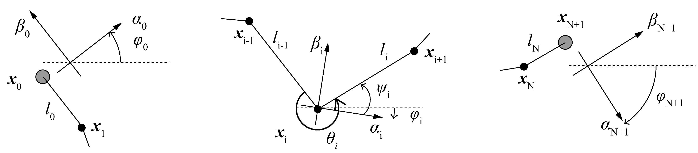

# Generalized diabolo model and analytical solution

## 1. Definitions
Let N diabolos on the string. We number the objects from left to right, left stick being 0 and right stick being N+1, diabolos being 1,...,N.
With these numberings, position $\boldsymbol{x_i} \: (i=0,...,N+1)$
 and their time-differentials velocity $\boldsymbol{u_i}$ and acceleration $\boldsymbol{a_i}$ are defined.

Let $\boldsymbol{l_i}$ the string segment vector between $\boldsymbol{x_i, x_{i+1}}$, and $l_i$ the length of it.
Unit vector $\boldsymbol{e_i}$ is also defined

$$
\begin{align}
&\boldsymbol{l_i} := \boldsymbol{x_{i+1}} - \boldsymbol{x_i} \:(i=0,...,N) \\
&l_i := |\boldsymbol{l_i}| \\
&\boldsymbol{e_i} := \frac{\boldsymbol{l_i}}{l_i}
\end{align}
$$

Rotating coordinate system $(\boldsymbol{\alpha_i} , \boldsymbol{\beta_i})$ (unit vectors) is defined for each object as shown in the figure below.
Let $\phi_i$ the rotaion angle.
$\phi_i$ is determined so that $\boldsymbol{\beta_i}$ is the bisector of two adjacent string segments.
Let $\theta_i$ the angle between two adjacent string segments.
$\phi_0, \phi_{N+1}$ at the sticks are defined so that $\boldsymbol{\beta_0},\boldsymbol{\beta_{N+1}}$ is parallel to the terminal string segment.

Here, these angles have a redundancy of $2n\pi$ .
This redundancy is utilized to naturally express the string wrapping around the axes of diabolos.
In the simplest situation where all the diabolos are simply sitting on the string without wrapping, 
$\theta_i$ are defined so that $0 \le\theta_i < 2\pi$ .
In this case, especially $\pi \le \theta_i < 2\pi$ , since diabolos are not flying.
Additionally, define so that $0 \le \phi_0 < 2\pi$ .
Then $\phi_i \: (i=1,...,N+1)$ is intuitively defined as shown below so that you tilt the coordinates as you go from left to right.

$$
\begin{align}
\phi_i := \phi_{i-1} + \frac{\theta_{i-1} - \pi}{2} + \frac{\theta_{i} - \pi}{2}\\
(\theta_0 = \theta_{N+1} = 0 \text{ for simple expression})
\end{align}
$$

In the time-dependent context, $0 \le \phi_0 < 2\pi$ at time 0.
Then all angles are allowed to change continuously.
The wrapping is introduced by the extension of this simplest situation.
As you wrap a diabolo i, you increase $\theta_i$ from $0-2\pi$ regime to $2\pi - 4\pi$ regime.
Also $\phi_i$ increase by about $\pi$.

To provide the language, "knot degree" $k_i$ is defined:
0 for zero-wrapped state, 
1 for single-wrapped state,
2 for double-wrapped state,
and so on.
Also k is
-1 for zero-wrapped recaptured state, 
-2 for single-wrapped recaptured state,
-3 for double-wrapped recaptured state,
and so on.

Accordingly, redundancy of $\theta_i$ can be determined based on the knot degree, $2k_i\pi \le \theta_i < 2(k_i+1)\pi$

Note that $-\pi \le \theta_i < \pi$ means that the diabolo would be flying and is not physically allowed.
This "flying regime" would provide useful boundaries when considering the situation where the diabolos actually detach from and attach to the string.
Now that all $\theta_i$ and $\phi_0$ is non-arbitrarily defined, 
$\phi_i$ is also non-arbitrarily defined by the definition above.

We define another angle $\psi_i$ as a simple derivative of $\theta_i$, 
which will be useful to simplify the equations later.

$$
\begin{gather}
\psi_i := \frac{\theta_i - \pi}{2}\\
\psi_0, \psi_{N+1} := - \frac{\pi}{2}\\
\dot{\psi_i} = \frac{\dot{\theta_i}}{2} \\
\end{gather}
$$

We adopted the system where we first define $\phi_0$ and $\theta_i$ , 
then secondarily defined $\phi_i$. 
But it is also possible to first define $\phi_{0,...,N}$ , 
then secondarily define $\phi_{N+1}$ and $\theta_i$.
Also $\theta$ and $\psi$ is completely interchangeable.
There is some arbitrariness in what is chosen for the state variable.

$\boldsymbol{u_i, a_i}$ can be expressed using the rotating coordinate system $(\boldsymbol{\alpha_i}, \boldsymbol{\beta_i}) \: (i=0,...,N+1)$ .

$$
\begin{gather}
\boldsymbol{u_i} = 
u_i^{\alpha}\boldsymbol{\alpha_i} + u_i^{\beta}\boldsymbol{\beta_i} =
\begin{pmatrix} u_{i}^{\alpha} \\ u_{i}^{\beta} \end{pmatrix} =
\begin{bmatrix}
    \cos{\phi_i} & -\sin{\phi_i} \\
    \sin{\phi_i} & \cos{\phi_i}
\end{bmatrix} 
\begin{pmatrix} u_{i}^{x} \\ u_{i}^{y} \end{pmatrix} \\
\boldsymbol{a_i} = 
a_i^{\alpha}\boldsymbol{\alpha_i} + a_i^{\beta}\boldsymbol{\beta_i} =
\begin{pmatrix} a_{i}^{\alpha} \\ a_{i}^{\beta} \end{pmatrix} =
\begin{bmatrix}
    \cos{\phi_i} & -\sin{\phi_i} \\
    \sin{\phi_i} & \cos{\phi_i}
\end{bmatrix} 
\begin{pmatrix} a_{i}^{x} \\ a_{i}^{y} \end{pmatrix} \\
\begin{pmatrix}
    \dot{u_i^\alpha} \\ \dot{u_i^\beta}
\end{pmatrix}
=\begin{pmatrix}
    a_i^\alpha - u_i^\beta \dot{\phi_i} \\
    a_i^\beta + u_i^\alpha \dot{\phi_i}
\end{pmatrix}
\end{gather}
$$

Given the above definitions, the interchangeable expressions of the system are obtained:

$$
\begin{align}
(\boldsymbol{x}_i, k_{1,...,N}, u_i^{x,y}) \Leftrightarrow (\boldsymbol{x}_0, l_{0,...,N}, \phi_0, \theta_{1,...,N}, u_i^{\alpha,\beta})
\end{align}
$$

The left side is a more intuitive expression with Cartesian coordinates, 
which will be useful when dealing with real data, or visualizing simulation results.
The right side is useful when dealing with analytical solutions.

One of the forces in play is the string tension.
Due to frictions at diabolos, tension is different among string segments.
Thus the tension is defined for each string segment as $T_i$ .
Tension vector is defined as

$$
\begin{align}
\boldsymbol{T_i} := T_i \boldsymbol{e_i}
\end{align}
$$

In order to handle the frictions, rotation of diabolo is introduced.
Let $r$ the radius of diabolo axis,
$I$ the rotational inertia,
and $m$ the mass of diabolo.
Then let $\omega_i$ the angular velocity of diabolo $i$, positive value of which means the rotation from left to right (clockwise).
The surface velocity of the axis is $w_i = r\omega_i$ .
Let $R$ the normalized rotational inertia (see below).
The surface-integrated friction is equal to the loss of string tension $S_i = T_{i-1} - T_{i}$ .
In the context of solving the system behavior, we only need $w$ and $R$ rather than $\omega, r, I$.
With simple rigid-body mechanics,

$$
\begin{align}
R := \frac{I}{mr^2} \\
I\dot{\omega_i} = rS_i \\
\text{Thus, }\dot{w_i} = \frac{S_i}{mR}
\end{align}
$$

If you account for aerodynamic drag $D$,
so that the rotational velocity is not accelerated limitlessly, 

$$
\begin{align}
\dot{w_i} = \frac{S_i}{mR} - D(w_i)
\end{align}
$$

In the linear friction regime, the integrated friction $S_i$ can be obtained by 
friction coefficient $c$, 
wrapping angle $\theta'$, 
and the relation of $w_i$ and the speed of diabolo movement against the string.
The last component is here refered to as "acceleration state", 
which can take "accelerating" state or "decelerating" state.

The speed of diabolo movement against the string can be obtained by 
looking at the string segments on the left side or right side of a given diabolo.
By comparing this and $w_i$, relative volocity $w_i'$ is defined

$$
\begin{align}
w_i' := w_i - \sum_{j=0}^{i-1}{\dot{l_j}} \\
\begin{cases}
\text{accelerating if } w_i' < 0\\
\text{decelerating if } w_i' > 0\\
\end{cases}
\end{align}
$$

The effective friction coefficient $c_i'$ is introduced to simply express the friction. 
In a certain approximation, capstan equation can be used,

$$
\begin{align}
\theta' &= 
    \begin{cases}
        \theta - \pi & (\theta >\pi)\\
        \theta + \pi & (\theta <-\pi)\\
    \end{cases} \\
c_i'(w_i') &:= 
    \begin{cases}
        -c &  w_i'<0 \\
        c  &  w_i'>0 \\
    \end{cases} \\
T_i &= T_{i-1} \times e^{c_i' \theta_i'}
\end{align}
$$

Here, the effective friction coefficient becomes a step function, ignoring the zero-velocity condition. 
Modifying $c_i'(w_i')$, such that it is zero when decelerating, easily accounts for bearing diabolos.
Additionally, this implies the possibility of extending to generalized continuous function, such as $c_i'(w_i') \approx \tanh$. 
And the step function would be represented as a certain limit case.

Suppose the system where the input is the force applied from hands to sticks. 
Let $\boldsymbol{F_0, F_{N+1}}$ the force applied to each stick. Let $M$ the mass of a stick. 
Let $\boldsymbol{g}$ the standard acceleration of gravity.
Then the equations of motions are,

$$
\begin{align}
M\boldsymbol{a_0}     &= \boldsymbol{T_0} + M\boldsymbol{g} + \boldsymbol{F_0} \\
M\boldsymbol{a_{N+1}} &= -\boldsymbol{T_N} + M\boldsymbol{g} + \boldsymbol{F_{N+1}} \\
m\boldsymbol{a_i}     &= \boldsymbol{T_i} - \boldsymbol{T_{i-1}} + m\boldsymbol{g}
\end{align}
$$

The constraint of the system is that the total length of string is a constant. 
Let $L$ the total length of string.
Then,

$$
\begin{align}
&L(t) = \sum_{i=0}^{N} l_i = L\\
&\Leftrightarrow \dot{L} = \sum_{i=0}^{N} \dot{l_i}  = 0 \text{ and } L(t=0)=L\\
&\Leftrightarrow \ddot{L} = \sum_{i=0}^{N} \ddot{l_i}  = 0\text{ and } L(t=0)=L\text{ and } \dot{L}(t=0)=0\\
\end{align}
$$

The goal is to solve these equations to get $\boldsymbol{a}$ as a function of $\boldsymbol{F}$.
Once $\boldsymbol{a}$ is obtained, 
the differential equations for the state of system $(\boldsymbol{x,u})$ are set, 
ready for numerical calculations.
($w$ should also be included, 
but they can be easily derived as secondary results.)

## 2. Solution

First, tensions are expressed as a function of $T_0$ .

$$
\begin{gather}
T_i = T_0 \times d_i \\
d_i := \exp(\sum_{j=1}^{i} c_j' \theta_j')\\
(d_0 := 1)
\end{gather}
$$

The constraint is solved geometrically,

$$
\begin{gather}
\dot{l_i} = - u_{i}^\alpha \cos \psi_{i}
-u_{i}^\beta \sin \psi_{i}
+u_{i+1}^\alpha \cos \psi_{i+1}
-u_{i+1}^\beta \sin \psi_{i+1} \\
\dot{L} = \sum_{i=0}^{N} \dot{l_i}
= u_0^\beta + u_{N+1}^\beta - 2\sum_{i=1}^{N} u_i^\beta \sin\psi_i 
=0\\
\ddot{L} = (a_0^\beta + a_{N+1}^\beta) + 
(u_0^\alpha \dot{\phi_0} +
u_{N+1}^\alpha \dot{\phi_{N+1}} ) +
2\sum_{i=1}^{N} (
a_i^{\beta}\sin \psi_i +
u_i^{\alpha} \dot{\phi_i} \sin \psi_i +
u_i^\beta \frac{\dot{\theta_i}}{2} \cos \psi_i)
=0
\end{gather}
$$

The equations of motions are rewritten in rotating coordinates,

$$
\begin{gather}
\begin{pmatrix}
a_0^{\alpha} \\ a_0^{\beta}
\end{pmatrix}
=\frac{1}{M}\begin{pmatrix}
0 \\ -T_0
\end{pmatrix}
-g\begin{pmatrix}
\sin \phi_0 \\ \cos \phi_0
\end{pmatrix}
+\frac{1}{M}
\begin{pmatrix}
F_0^\alpha \\ F_0^\beta
\end{pmatrix} \\
\begin{pmatrix}
a_{N+1}^{\alpha} \\ a_{N+1}^{\beta}
\end{pmatrix}
=\frac{1}{M}\begin{pmatrix}
0 \\ -T_{0} d_{N}
\end{pmatrix}
-g\begin{pmatrix}
\sin \phi_{N+1} \\ \cos \phi_{N+1}
\end{pmatrix}
+\frac{1}{M}\begin{pmatrix}
F_{N+1}^\alpha \\ F_{N+1}^\beta
\end{pmatrix} \\
\begin{pmatrix}
a_{i}^{\alpha} \\ a_{i}^{\beta}
\end{pmatrix}
=\frac{T_0}{m} \begin{pmatrix}
(d_{i} - d_{i-1}) \cos\psi_i \\ (d_{i} + d_{i-1}) \sin\psi_i
\end{pmatrix}
-g\begin{pmatrix}
\sin \phi_{i} \\ \cos \phi_{i}
\end{pmatrix}
\; (i=1,...,N)
\end{gather}
$$

With this,

$$
\begin{align}
\ddot{L} = &(a_0^\beta + a_{N+1}^\beta) + 
(u_0^\alpha \dot{\phi_0} +
u_{N+1}^\alpha \dot{\phi_{N+1}} ) \\
&+2\sum_{i=1}^{N} (
(
    \frac{T_0}{m} (d_i + d_{i-1})\sin\psi_i)
    -g\cos\phi_i
)
\sin \psi_i +
u_i^{\alpha} \dot{\phi_i} \sin \psi_i +
u_i^\beta \frac{\dot{\theta_i}}{2} \cos \psi_i) \\
= &(a_0^\beta + a_{N+1}^\beta) + 
(u_0^\alpha \dot{\phi_0} +
u_{N+1}^\alpha \dot{\phi_{N+1}} ) \\
&+2\sum_{i=1}^{N}
(g\cos\phi_i\sin\psi_i + u_i^\alpha \dot{\phi_i} \sin\psi_i + u_i^\beta \frac{\dot{\theta_i}}{2}\cos\psi_i)
+\frac{2T_0}{m}\sum_{i=1}^{N}
(d_i + d_{i-1})\sin^2\psi_i \\
= & 0
\end{align}
$$

$$
\begin{multline}
T_0 = 
(a_0^\beta + a_{N+1}^\beta) \frac{1}
{\frac{2}{m}\sum_{i=1}^{N}
(d_i + d_{i-1})\sin^2\psi_i} \\
+
\frac{
    (u_0^\alpha \dot{\phi_0} +
    u_{N+1}^\alpha \dot{\phi_{N+1}} )
    +2\sum_{i=1}^{N}
    (g\cos\phi_i\sin\psi_i + u_i^\alpha \dot{\phi_i} \sin\psi_i + u_i^\beta \frac{\dot{\theta_i}}{2}\cos\psi_i)
}
{\frac{2}{m}\sum_{i=1}^{N}
(d_i + d_{i-1})\sin^2\psi_i} \\
=(a_0^\beta + a_{N+1}^\beta)A_1 + A_2
\end{multline}
$$

Note that

$$
\begin{gather}
\dot{\phi_i} = 
\dot{\phi_i}
(l_{(i-1),i},\theta_{(i-1),i,(i+1)},u_{(i-1),i,(i+1)}^{\alpha, \beta}) \\
=\frac{1}{2}(
\frac{
u_{i+1}^\alpha \sin\psi_{i+1} +
u_{i+1}^\beta \cos\psi_{i+1} +
u_{i}^\alpha \sin \psi_{i} -
u_{i}^\beta \cos \psi_{i}
}
{l_{i}} \\+
\frac{
u_{i}^\alpha \sin\psi_{i} +
u_{i}^\beta \cos\psi_{i} +
u_{i-1}^\alpha \sin \psi_{i-1} -
u_{i-1}^\beta \cos \psi_{i-1}
}
{l_{i-1}}
) \\
\dot{\phi_0} = 
\dot{\phi_0}
(l_{0},\theta_{1},u_{1}^{\alpha, \beta},u_{0}^{\alpha}) =
\frac{
u_{1}^\alpha \sin\psi_{1} +
u_{1}^\beta \cos\psi_{1} -
u_{0}^\alpha 
}
{l_{0}} 
\\
\dot{\phi}_{N+1} = 
\dot{\phi}_{N+1}
(l_{N},\theta_{N},u_{N}^{\alpha, \beta},u_{N+1}^{\alpha}) =
\frac{
u_{N}^\alpha \sin\psi_{N} -
u_{N}^\beta \cos\psi_{N} -
u_{N+1}^\alpha 
}
{l_{N}} 
\\
\dot{\theta_i} = 
\dot{\theta_i} 
(l_{(i-1),i},\theta_{(i-1),i,(i+1)},u_{(i-1),i,(i+1)}^{\alpha, \beta})
\\ =
(
\frac{
u_{i+1}^\alpha \sin\psi_{i+1} +
u_{i+1}^\beta \cos\psi_{i+1} +
u_{i}^\alpha \sin \psi_{i} -
u_{i}^\beta \cos \psi_{i}
}
{l_{i}} \\-
\frac{
u_{i}^\alpha \sin\psi_{i} +
u_{i}^\beta \cos\psi_{i} +
u_{i-1}^\alpha \sin \psi_{i-1} -
u_{i-1}^\beta \cos \psi_{i-1}
}
{l_{i-1}}
) \\
w_i' = w_i'(w_i,u_{0,...,i}^\beta, u_i^\alpha,\theta_{1,...,i}) =
w_i - \sum_{j=0}^{i-1}{\dot{l_j}}  \\
(
\sum_{j=0}^{i-1}{\dot{l_j}} = 
u_0^\beta + u_i^{\alpha} \cos \psi_i - u_i^{\beta} \sin \psi_i -
2\sum_{j=1}^{i-1} u_j^{\beta} \sin \psi_j
) \\
d_i = d_i (w_{0,...,i},u_0^\beta,u_{1,...,i}^{\alpha,\beta},\theta_{1,...,i})
\end{gather}
$$

Thus, both $A_1,A_2$ are a state function,

$$
\begin{gather}
A_1 = A_1(w_{0,...,N},\theta_{1,...,N},u_{0,...,N+1}^\beta,u_{1,...,N}^{\alpha}) \\
A_2 = A_2(w_{0,...,N},\theta_{1,...,N},l_{0,...,N},u_{0,...,N+1}^{\alpha,\beta})
\end{gather}
$$

Lastly,

$$
\begin{gather}
\begin{cases}
a_0^\beta = 
-\frac{1}{M}((a_0^\beta + a_{N+1}^\beta)A_1 + A_2) - 
g\cos\phi_0 + 
\frac{1}{M}F_0^{\beta}
\\
a_{N+1}^\beta = 
-\frac{1}{M} d_{N} ((a_0^\beta + a_{N+1}^\beta)A_1 + A_2) - 
g\cos\phi_{N+1} + 
\frac{1}{M}F_{N+1}^{\beta}
\end{cases} \\
(a_0^{\beta} + a_{N+1}^{\beta}) =
-\frac{A_1}{M}(1+d_N) (a_0^{\beta} + a_{N+1}^{\beta})
+\frac{A_2}{M}(1+d_N)
-g(\cos \phi_0 + \cos \phi_{N+1})
+\frac{F_0^\beta + F_{N+1}^\beta}{M} \\
(a_0^{\beta} + a_{N+1}^{\beta}) = 
\frac{(F_0^\beta + F_{N+1}^\beta) }
{M + A_1(1+d_N)} +
\frac{A_2(1+d_N) - Mg (\cos \phi_0 + \cos \phi_{N+1})}
{M + A_1(1+d_N)} \\
= A_3(F_0^\beta + F_{N+1}^\beta) + A_4 \\
\begin{cases}
a_0^\beta = 
-\frac{1}{M}((A_3(F_0^\beta + F_{N+1}^\beta) + A_4)A_1 + A_2) - 
g\cos\phi_0 + 
\frac{1}{M}F_0^{\beta}
\\
a_{N+1}^\beta = 
-\frac{1}{M} d_{N} ((A_3(F_0^\beta + F_{N+1}^\beta) + A_4)A_1 + A_2) - 
g\cos\phi_{N+1} + 
\frac{1}{M}F_{N+1}^{\beta}
\end{cases} \\
\begin{cases}
a_0^\beta = 
\frac{1 - A_1 A_3}{M} F_0^\beta - \frac{A_1 A_3}{M}F_{N+1}^\beta
-(g\cos\phi_0
+\frac{A_1 A_4 + A_2}{M})
\\
a_{N+1}^\beta = 
-\frac{d_N A_1 A_3}{M} F_0^\beta + \frac{1 - d_N A_1 A_3}{M}F_{N+1}^\beta
-(g\cos\phi_{N+1}
+d_N\frac{A_1 A_4 + A_2}{M})
\end{cases} \\
\begin{pmatrix}
a_0^\beta \\ a_{N+1}^\beta
\end{pmatrix}
= \begin{bmatrix}
\frac{1 - A_1 A_3}{M}  & - \frac{A_1 A_3}{M} \\
-\frac{d_N A_1 A_3}{M} & \frac{1 - d_N A_1 A_3}{M}
\end{bmatrix}
\begin{pmatrix}
F_0^\beta \\ F_{N+1}^\beta
\end{pmatrix}
+\begin{pmatrix}
-(g\cos\phi_0 +\frac{A_1 A_4 + A_2}{M}) \\
-(g\cos\phi_{N+1} +d_N\frac{A_1 A_4 + A_2}{M})
\end{pmatrix} \\
\end{gather}
$$

Additionally,

$$
\begin{gather}
T_0 = A_1 A_3(F_0^\beta + F_{N+1}^\beta) + (A_1 A_4 + A_2) \\
\begin{cases}
a_0^\alpha = \frac{1}{M} F_0^\alpha -g\sin\phi_0 \\
a_{N+1}^\alpha =\frac{1}{M} F_{N+1}^\alpha -g\sin\phi_{N+1}   
\end{cases} \\
\begin{pmatrix}
a_{i}^{\alpha} \\ a_{i}^{\beta}
\end{pmatrix}=
\frac{A_1 A_3}{m} 
\begin{pmatrix}
(d_{i} - d_{i-1}) \cos\psi_i \\ (d_{i} + d_{i-1}) \sin\psi_i
\end{pmatrix}
(F_0^\beta + F_{N+1}^\beta)+
(
\frac{A_1A_4+A_2}{m}
-g\begin{pmatrix}
\sin \phi_{i} \\ \cos \phi_{i}
\end{pmatrix}
)\\
\end{gather}
$$

Therefore,

$$
\begin{gather}
\begin{pmatrix}
a_0^\alpha \\ a_{N+1}^\alpha \\ 
a_0^\beta\\ a_{N+1}^\beta \\ 
a_i^\alpha\\ a_i^\beta \\ 
...\\ ... \\ 
\end{pmatrix}
= \begin{bmatrix}
\frac{1}{M} & 0 & 0 & 0\\
0 & \frac{1}{M} & 0 & 0\\
0 & 0 & \frac{1 - A_1 A_3}{M}  & - \frac{A_1 A_3}{M} \\
0 & 0 & -\frac{d_N A_1 A_3}{M} & \frac{1 - d_N A_1 A_3}{M}\\
0 & 0 & \frac{A_1 A_3 (d_{i} - d_{i-1}) \cos\psi_i }{m} & \frac{A_1 A_3 (d_{i} - d_{i-1}) \cos\psi_i }{m} \\
0 & 0 & \frac{A_1 A_3 (d_{i} + d_{i-1}) \sin\psi_i }{m} & \frac{A_1 A_3 (d_{i} + d_{i-1}) \sin\psi_i }{m} \\
... \\
... \\
\end{bmatrix}
\begin{pmatrix}
F_0^\alpha \\ F_{N+1}^\alpha \\
F_0^\beta \\ F_{N+1}^\beta
\end{pmatrix}
+\begin{pmatrix}
-g\sin\phi_0\\
-g\sin\phi_{N+1}\\
-(g\cos\phi_0 +\frac{A_1 A_4 + A_2}{M}) \\
-(g\cos\phi_{N+1} +d_N\frac{A_1 A_4 + A_2}{M})\\
\frac{A_1A_4+A_2}{m} -g \sin \phi_{i} \\
\frac{A_1A_4+A_2}{m} -g \cos \phi_{i} \\
...\\
...\\
\end{pmatrix} \\
=\boldsymbol{BF}+\boldsymbol{C}
\end{gather}
$$

where $\boldsymbol{B} \; (2(N+2)\times 4)$,$\boldsymbol{C} \; (2(N+2)\times 1)$ are state functions.
Adding the equations for the rotational motions will complete the solution,

$$
\begin{gather}
\dot{w_i} = \frac{S_i}{mR} - D(w_i) = \frac{- T_0(d_{i}-d_{i-1})}{mR} -D(w_i) \\
= - \frac{A_1A_2 (d_i - d_{i-1})}{mR}(F_0^\beta+F_{N+1}^\beta) - 
(\frac{(A_1A_4+A_2)(d_i-d_{i-1})}{mR} + D(w_i))
\end{gather}
$$

It is interesting to see that $\alpha$ components of input forces only affect the $\alpha$ direction acceleration.
Also, in $\alpha$ direction, the sticks only feel the gravity, and you can move the sticks almost freely.
In $\beta$ direction, you feel the tension so that you need much stronger or weaker force to move the sticks than free motions.
These results match intuition.

Formally, these accelerations can be used to obtain the time derivatives of positions and velocities, 
which is the final analytical solution of this (nonlinear) system.