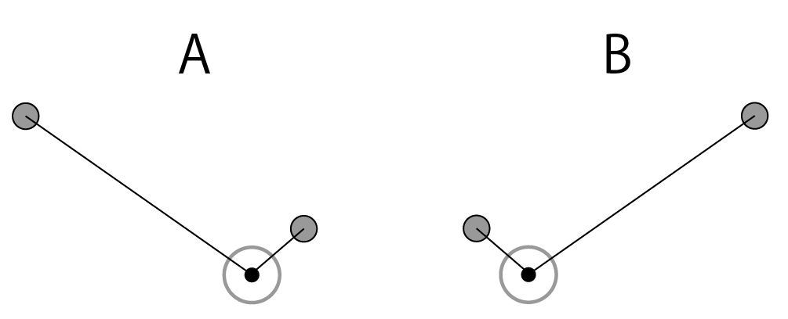
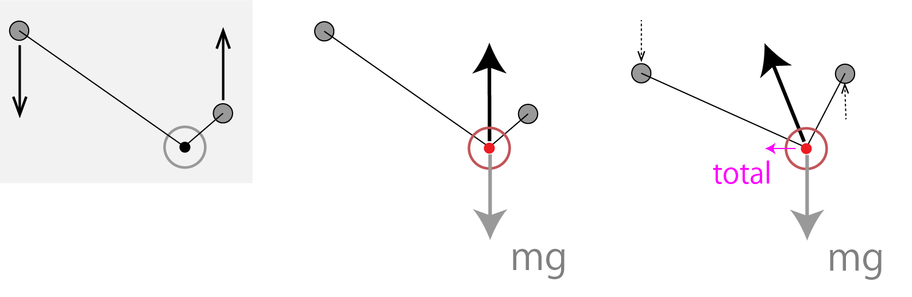
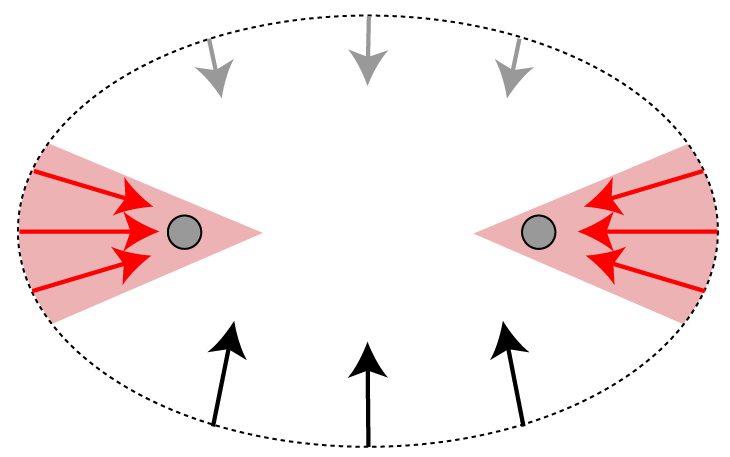
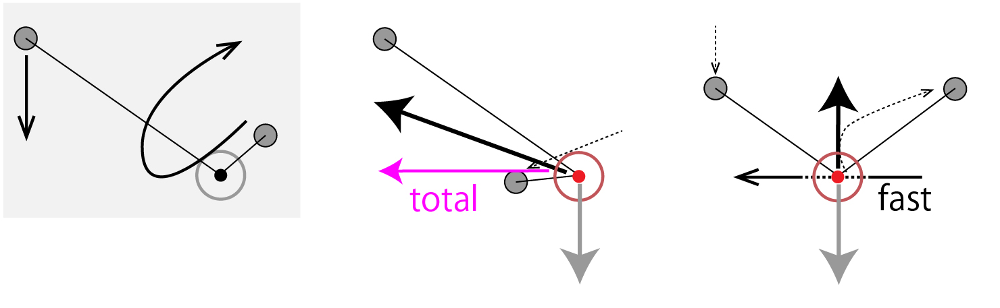

# 「押す」動作

## 1. 前置き: 基礎要素としてのディアボロ移動

ディアボロの技というのは、当然等速楕円運動だけでは成り立ちません。
ディアボロの移動速度を自在に変化させ、右へ左へと移動させることが基礎的な要素としてあります。例えばハイトスにしても、ディアボロは右でキャッチし左へ移動させ、上へ射出します。その際に、プレイヤーにはディアボロを右から左へ「押して動かす」、左手で上に「飛ばす」感覚があります。明らかに、両手の移動を介してディアボロに加速度を与え、移動速度をコントロールしています。

しかし、このディアボロに力を与えるという基礎的な要素に焦点を絞って解析や練習をしている例は少ないと思います。基本的には、技を練習していく中でプレイヤーの「こうすればこう動く」という経験の積み重ねにより、無意識化でディアボロを移動させる技術が培われます。

このようなトップダウンの経験的な理解は、ディアボロの技術習得という観点においては必ずしも悪ではありません。複雑で高速な技をみにつける際、反復練習により基礎的な動作を無意識化でできるようにする面が大きいからです。熟練したプレイヤーは動体視力や情報処理速度に優れているという一般的なイメージがあるかもしれません。しかしそれより、ディアボロ移動などの基礎要素からトス、サン、ジェノサイドといった基礎技まで幅広く無意識的にこなせる分、集中力のリソースをより高次の部分に使えるというのが私の見方です。

一方で、初・中級者による学習段階において、このようなトップダウン型の学習だけでは、「上手くディアボロが動かない」などのトラブルシューティングの際に立ち往生してしまいます。より基礎的なディアボロの移動や楕円運動といった部分を見直し、理解しながらステップアップしていく習得方法も、一つの選択肢としてアリだと思います。

さらに先端的な例として、ディアボロのコントロールという基礎要素を明示的にアピールした技が最近ではじめています。トッププレイヤーの[Guillaume Karpowicz氏から出た動画『Reductionism』](https://www.youtube.com/watch?v=cveC44xoVKQ)がマイルストーンでしょう。

> The central idea is that diabolo is very easily put in motion with seemingly no source of movement since the tension of the string is barely visible. That principle is specific to diabolo and I chose to base my recent material on it. Hence all the string climbs, translations and bounces that require no big movement. 概要欄より

> ディアボロは、もちろん紐の張力は見えないから、見かけ上の動力が無いのにも関わらず、簡単に移動させることが出来る。私は最近の作品を、このディアボロ特有の原理に位置付けることにした。結果として、すべてのエレベーター、移動、バウンド等を、大きな動作なしに実現できた。

トッププレイヤーであるGuillaume氏からでた動画の内容、『還元主義』というタイトル、概要欄のコメントを合わせてみると、ディアボロの移動という最たる基礎を再考することで、新たな技術の開拓に挑んでいることがうかがえます。(本人の考えはわかりませんが)

ディアボロの移動の力学的背景・原理を理解することで、新たな技術の開拓につながると期待できます。さらに、この動画を観るさいに、不思議だなあと感じるのみならず、原理を理解しているとより深くディアボロを味わえます。こういった観る側の教養としても、動作原理の理解には重要な役割があります。競技ディアボロのジャッジにおいても、こういった理解の普及は(厳密性は要らないにしても)必要になるかもしれません。

今回は、ディアボロを移動させるとはどういうことなのか、『見えない張力』を見ることから始めて考えていきましょう。私の言葉使いでは『張力』=垂直抗力です。ゆくゆくはハイトスなどの理論につながる予定です。

## 2. ディアボロの遅い横移動

もっとも単純な技として、ディアボロを右から左に移動させることを考えましょう。状態AからBに変化させたいとします。

両手の高低差はあえてつけています。定常的にディアボロを置きたい場合、ディアボロにかかる垂直抗力Vと重力mgが釣り合う、つまりVが垂直上向きである必要があります。必然的に紐が垂直線に対して対称な角度を取る必要があり、高低差がうまれます。

さてAをBにするには、まず単純に両手の高低差を逆転させる方法があります。しかしプレイヤーなら想像がつくと思いますが、このやり方だとディアボロはゆっくりと左へ移動します。なぜなら、垂直抗力Vは常に紐の二等分線に平行だからです。どんなに力のいれかたを工夫しても、これは覆せない原理です。これは上記動画でも頻出の動作です。

このやりかたではディアボロは基本的に常に楕円軌道の下側に位置します。したがって、ディアボロに掛かる力は基本的に上向きで、動作中に紐の成す角度が変化することにより、totalでわずかな左向きの力をかけることができます。

ここで速く移動させるため、両手を上向きに動かし強い力を加えたとしましょう。この場合、垂直方向の成分について考えると、mgよりVが大きくなり、ディアボロは上に移動してしまいます。紐の角度が決まってしまえば、Vの方向は変えることができません。mgとVの垂直方向成分が釣り合った状態を維持する限り、横方向の力は小さい値から変化させることはできません。したがって、このやり方では真横に速く移動させることは不可能です。

## 3. 両手の位置が決まれば、ディアボロにかかる力は変えられない。

この例で考えてみたように、実はディアボロにかかる力=加速度は、プレイヤーが思っているよりも不自由です。ディアボロをやっていると、あたかも自分の力のかけ方でディアボロを操っているように感じてしまいますが、実際には自分でコントロールできるのは垂直抗力Vの大きさだけで、方向は変えられません。

楕円軌道とVの方向について描画してみると、およそ次のようになります。ディアボロに横向きの加速度を与えたい場合、楕円軌道の側方のかなり限られた角度にディアボロを配置する必要があります。この領域は当然円軌道に比べて狭くなります。

ディアボロを速く横移動させようとした場合、手の位置を変化させ、ディアボロをこの領域にいれなければいけません。

## 4. 押す」の正体

それでは実際どうしましょうか。プレイヤーの感覚でいえば、右手で軽くディアボロを「押せ」ばいいですね。しかし、「張力は見えない」のでディアボロを明示的に押すことはできません。実際に考えてみると、ディアボロを「押す」時には右手を時計回りに素早く回転させ、その際に左向きの力を加えていると思います。

このとき、右手はディアボロの左側に素早く潜り込みます。この瞬間、ディアボロは横向きの力を受けられる領域にはいります。そしてこの時、右手で右スティックを左に「押す」のです。実際にディアボロを動かしているのは紐ですから、当たり前ですが紐はディアボロを引くことしかできません。しかしプレイヤー目線では、右手を掌方向に動かすことになるので、「押している」感覚が得られるのだと思います。

さて、右手がディアボロの左側に潜り込めば、ディアボロはかなり左に倒れた向きのVを受けます。垂直成分が釣り合うなら、水平方向のVは傾いた分だけ大きくなります。したがってディアボロは左方向の強い加速度を受け、大きな移動速度を得ます。

後は手の位置を戻し、ディアボロを楕円の下側で左側に滑っていくのを待てばいいです。初速を得た分、ディアボロは楕円軌道にそって高速で左に移動します。

## 5. 両手にかかる力は常に同じ

最後に少し補足です。今回の説明では右手の動きに注目して解説しました。「右手で押す」というように、感覚的には左手は(小さな上下移動を除いて)何もしていないと思われがちです。しかし、両手すなわちスティックの先端にかかる力は、紐からの張力のみです。そして紐が張っている限り、摩擦を無視すれば張力は全長にわたって一定です。したがって左右の手に掛かっている力は常に張力Tで等しくなっています。

つまり、右手で強い力をかけている=ディアボロに強い垂直抗力を与えている=紐に強い張力を与えている=左手にも強い力がかかっている、という物理的要請により、実際のところ片手で力をかけることは摩擦を無視すれば不可能です。

当然大きく移動している右手の方が、多くの運動エネルギーをディアボロに与えていますが、瞬間的に必要な力は常に等しいのです。腕の筋肉にまでさかのぼって考えると、右手はコンセントリック収縮、左手はアイソメトリックorエキセントリック収縮という違いはあるものの、力は同じです。

ディアボロの技を注意ぶかく観察すると、意識していない側のスティックが引っ張られて無意識的に動いてしまっていることがほとんどです。例えばハイトスにおいてキャッチ時、普通右手だけを意識しますが、引っ張られて左手も内側に動いている場合が多いです。このような無意識下での運動に注目することで、技術向上につながる可能性もありますね。