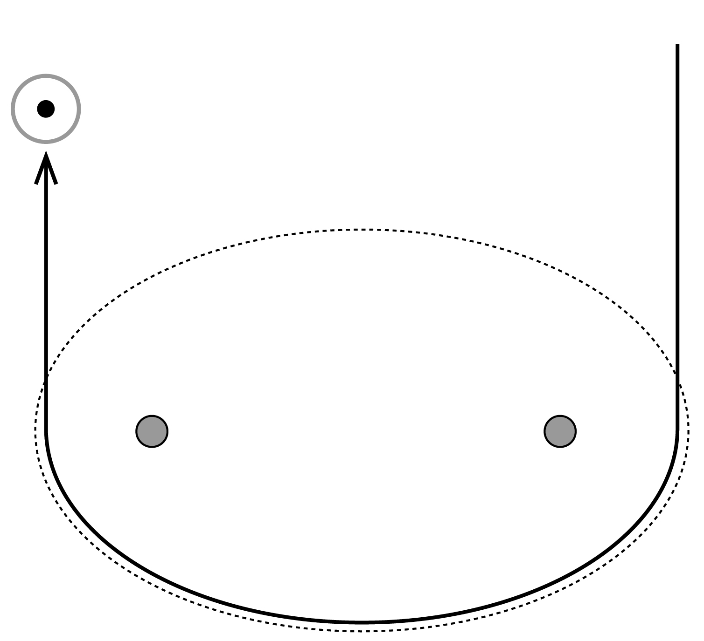
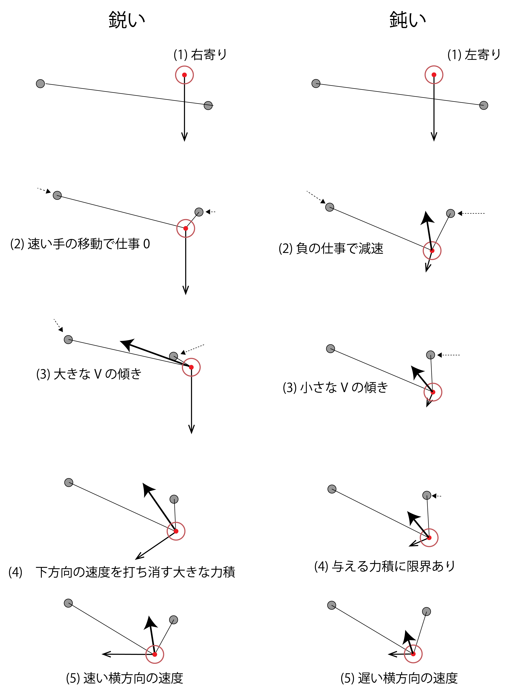
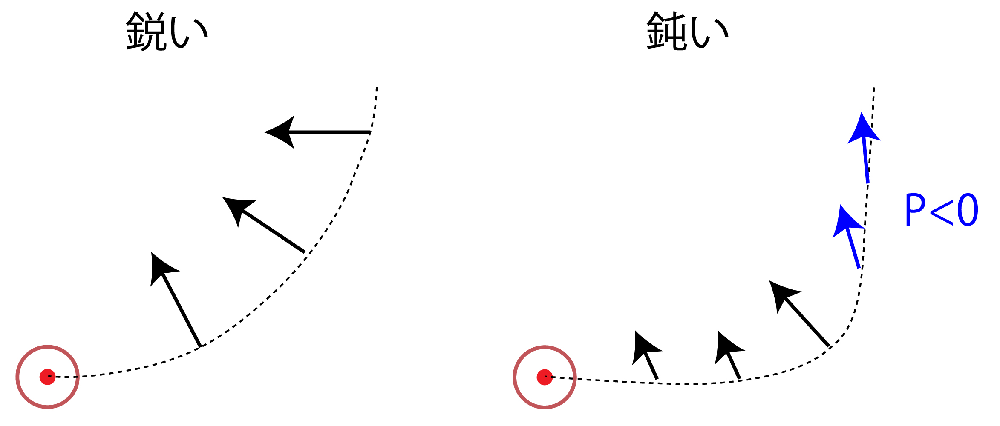
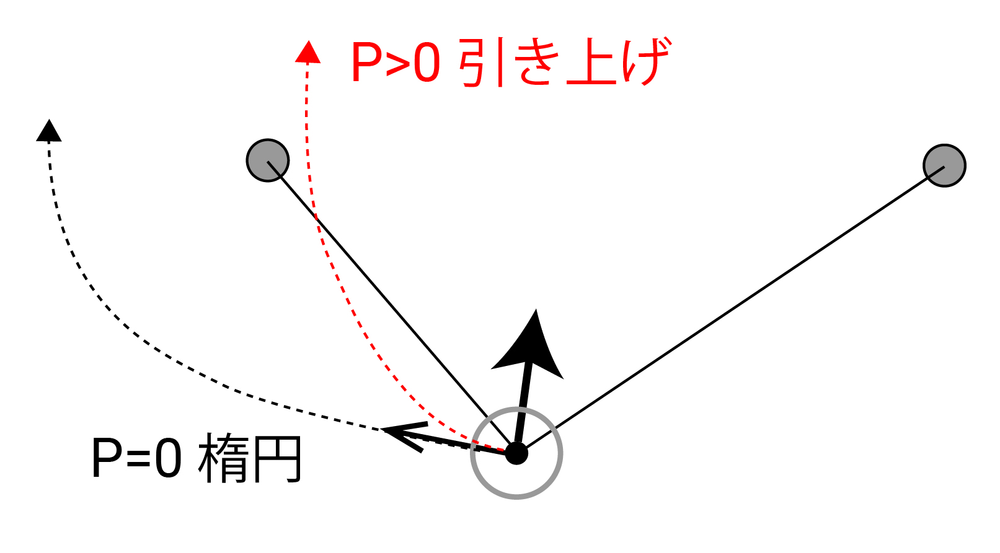
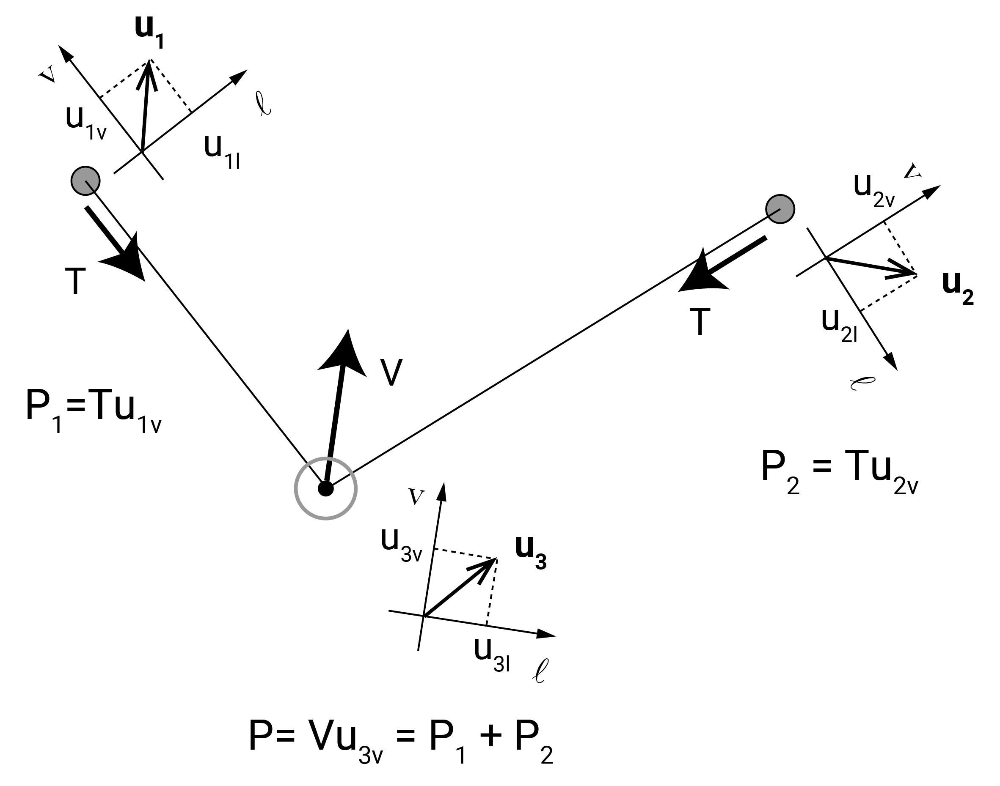
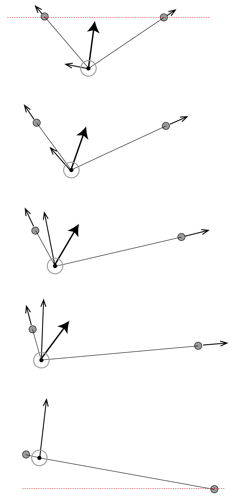

# ハイトスはなぜ飛ぶ？

## 1. ハイトスの3つの段階: 押す、楕円、引き上げる
ハイトスの要件をまとめると、下向きの速度で右側に落ちてきたディアボロをキャッチし、速度を左向きに変化させて横移動させ、さらに速度を上向きに変化させ左側から上向きに飛ばす、ということになります。

まず単純に、ディアボロが右から左に楕円運動で移動すれば完了！と思いつきますね。

これは単純で良いスタート地点ですが、現実にはそぐわないです。まず、エネルギーを損なわず同じ速度で投げ返すには、正確に楕円軌道の側方でキャッチし側方で投げなければいけませんが、これは現実では起こりません。また、ハイトスは技によって高度を変化させる必要があり、ディアボロに運動エネルギーを与えたり減らしたりできる仕組みが必要です。

以上を踏まえ今回は、キャッチから投げまでを3段階に分けて考えます。まずは、ディアボロを右手付近でキャッチし、右手の「押す」動作によってディアボロの速度を左向きに変える段階。次に、一瞬両手の動きが止まりディアボロを左に移動させる楕円軌道の段階。最後に、ディアボロに右上方向の力をかけ、両腕を広げながら飛ばす段階です。

動画を見たり実験したりして、ハイトスの仕組みを自分が妥当だと思える範囲で単純化したところ、このようになりました。それでは詳しくみていきます。

## 2. 押しの「鋭さ」を定義する
まず最初の押す動作ですが、これは前回解説した横移動での押す動作と基本は変わりません。右手側に落ちてきたディアボロをキャッチした後、右手を素早く内側に移動させ、左向きの垂直抗力を与えて、ディアボロの下向きの速度を左向きへと変化させます。

ハイトスの場合はもともとディアボロが下向きの大きな速度を持っているため、垂直抗力の傾きは少しでも大丈夫です。よって、右手がディアボロの左上くらいにあっても成立します。

また、必要な力積が大きいため、押しが完了するまでに時間がかかります。左上向きの力をある程度の時間かけ続ける事になり、その間のディアボロや手の動きをダイナミックに考える必要があります。

以上を踏まえ、ハイトスにおける押しを分析していきます。この記事では、押しを「鋭い押し」と「鈍い押し」の、二つの極端なフォームに分類して考えます。当然、実際のフォームはこれらが適宜混ざり合った中間のものだという前提です。ディアボロの速度と垂直抗力、手の動きを図示すると次のようになります。重力は垂直抗力より十分小さいものとして、無視していますが、仮に考慮しても大きな違いはありません。

「鋭い押し」では(1)(2)(3)にかけて、ディアボロが落ちてくるスピードを上回る速さで右手を内側に移動させます。これにより、(3)の状態にて大きく傾いたVを与えることができます。右手の移動距離が小さくて済むよう、(1)のキャッチ時にディアボロが右に寄っている必要があります。

ディアボロをキャッチした直後、ディアボロが下に動く紐の余裕を作るため、必然的に両手を内側へと寄せることになります。ここで、両手の内側への移動が十分に早ければ、ディアボロへの負の仕事を伴わず、減速させずに手を移動できます。これにより「鋭い押し」では、(2)でディアボロの下方向速度を維持したまま、垂直抗力をかけるステップに至ります。

一方「鈍い押し」では、ディアボロは(1)左寄りでキャッチします。右手の移動速度に限界があるため、垂直抗力を大きく傾けるのは難しくなります。下向きの速度を持ったディアボロに上向きの垂直抗力が働くため、必然的にディアボロは減速します。両手を内側に寄せる動作を遅くすれば、(2)下向きの速度を持ったディアボロに上向きの力がかかることになり、負の仕事率(=速度と力の内積)でディアボロは減速します。こうして、鋭い押しとは対照的に、遅い速度を持ったディアボロに対し、傾きの小さな垂直抗力をかけるステップに至ります。

最後の(4)(5)のステップでは、下向きの速度を持ったディアボロに対し左上向きの垂直抗力をかけることで、下向きの速度を相殺しつつ、左向きの速度を与えます。ここで、力積が運動量変化に等しいという簡単な力学的要請により、与えてよい力積の大きさに限界が生じます。下向きの速度が速い「鋭い押し」の場合では、(4)大きな左上方向の力積を与えて(5)速い左方向速度を実現できます。一方「鈍い」場合では、下向きの速度が遅いため、同様の力積を与えると最終速度が左上方向になってしまいます。したがって、最終速度を水平左向きにするためには、(4)小さい力積を与え、(5)遅い左方向速度で終わるしかありません。

ディアボロの軌道と力を重ねて描くと、おおよそ次のようになります。進行方向と力が反対を向いているところで、仕事率Pが負になります。

それでは、鋭い押しと鈍い押しはどちらが良いのでしょうか？単純に考えると、鋭いフォームの方が望ましいでしょう。まず、ハイトスにおいては、右で取って左で投げる、その間隔が広い方が衝突のリスクが減ります。その点において、ディアボロは右手ぎりぎりで取るほうが良いです。次に、ハイトスにおいて高さを押さえインターバルを短くするには、ディアボロが紐に乗っている時間を短くする必要があります。速い横方向速度を与えられる「鋭い押し」の方が、この点においても有利です。

ただし、高く投げたディアボロをキャッチする場合には、「鋭い押し」は難しくなります。右手ぎりぎりでキャッチすることには問題ありませんが、落下速度が速すぎて、右手をディアボロの左側に素早く入れるのが困難になります。また、落下速度が速すぎる場合、両手の出せる瞬間的な力の限界を超え、両手がディアボロに引っ張られて「鈍い押し」に近づきます。したがって、右手寄りでキャッチしたとしても、その後の動きは「鈍い押し」に近いものになるでしょう。多少減速させた方がその後のコントロールが容易になるでしょうし、鈍い押しはむしろ有利かもしれません。

また、ミスをしたり特殊な技をやる場合、ディアボロを左寄りでキャッチしなければならない事があります。その場合、当然「鈍い押し」を使うことになります。

実際のフォームはこれら二つのミックス・中間であり、そのバランスや細部は人によって、また状況によって異なります。これらの「鋭い・鈍い」という分類とその要素を念頭にハイトスを観察すると、発見があるかもしれません。

(3)引き上げにおける仕事率 - 左手はやや高め?
押しによって左方向の速度を得たディアボロは、楕円軌道によって左側へ移動し、引き上げの動作へと進みます。楕円軌道について特筆すべき点はないため、引き上げについて分析します。

引き上げは押しに比べて単純に、いかにディアボロに仕事をするか、という点に絞って分析します。楕円軌道による移動が終了し、ディアボロが左よりに位置したとき、下図のようになります。速度と力で矢印の種類を変えています。このまま楕円軌道を続けると、ディアボロは仕事率0を維持したまま左の方へ進んでいきます。「引き上げ」の動作によって、ディアボロは上向きに正の仕事をされて、速度を上げながら軌道を上向きに変え、最終的には射出されます。

実際のハイトスにおいては、ディアボロの横方向の移動速度はたいてい小さいです。引き上げによってディアボロに運動エネルギーを与え、速度を上昇させる必要があります。しかし、ディアボロに仕事をするには、プレイヤーはどうすればいいのでしょうか。仕事のない楕円軌道からスタートした本シリーズですが、ここでようやく、仕事率について基礎的な記述を与えておこうと思います。

単純化のために重力を無視しますが、重力は位置エネルギーを考えれば後から簡単に追加できます。すると、今考えている系ではエネルギーの担い手がディアボロの運動エネルギーだけになります。よってエネルギー保存を考えれば、ディアボロがされる仕事率Pは、左手が紐にする仕事率P1と右手がする仕事率P2の和になります。

さらに、仕事率は力と速度の内積なので、各仕事率は比較的簡単に求めることができます。手に掛かる力は張力T、ディアボロにかかる力は垂直抗力Vですが、これらの力に水平な方向をv方向 (vertical)、垂直な方向をl (lateral)方向とします。各物体について、それぞれの v-l 座標軸を与え、速度ベクトルuの各成分を得ます。(数学的に気持ち悪いですが、わかりやすいのでこれでいきます)。すると、仕事率は力の大きさとv方向速度の単純なかけ算になります。

以上より、ディアボロにする仕事率に関与するのは、v方向の速度のみだとわかります。手をどれだけ l 方向に動かそうが、またディアボロがどれだけl方向に動こうが、ディアボロは加減速しません。例えば楕円軌道では、両手を固定しているため系にされる仕事はゼロ、ディアボロは常に l 方向に動くためエネルギー一定、と導けます。

これらを踏まえて、引き上げにおいて仕事率を最大化するフォームは、常に手を紐と水平方向に動かし続けるフォーム、下図のようになります。ここでも、速度と力で矢印の種類を変えてあります。(もう少し厳密には、逐次的に手の速さを最小化、仕事率を最大化し続けるフォーム)

ここまで、かなりラフな議論で引き上げについて考えてきたのに、上の図がかなり実物に似ているのは驚きです。もしかすると、人体の構造として、力の方向と移動方向が一致している方が自然に感じられ、結果上記のようなフォームに落ち着くのかもしれません。

そして、この図から2点ほど重要なポイントが見て取れます。まず、ディアボロを左から飛ばすハイトスにおいて、引き上げの"理想的"なフォームでは左手を上方向へ、右手を右方向へと動かすことになります。これにより、両手同じ高さからスタートした場合、自動的に左手がやや高いフォームで射出を行うことになります。俗に言われる「左手が高い方が良い？」言説の由来は、ここにあるのではないかと思っています。

次に、右手の右移動が引き上げに貢献する点です。引き上げにおいて右手に意識をむける人は多くないと思いますが、実際にはほとんどの人が右手の右移動を使っています。この意識の乖離はおそらく、引き上げ動作と次のディアボロを取りに行く動作が融合している点に由来します。ハイトスはそもそも両手の開閉を伴うもので、「押し」によって左に移動した右手を、次のキャッチのために右に戻すことで、サイクルが完結します。インターバルの狭い理想的なハイトスでは、次のディアボロを取りに行くための動作が、実は引き上げに貢献している、ということになります。

(4)人それぞれ
ハイトスという技に正解はありません。どんなへんてこなフォームでもハイトスは出来ますし、個数や技、体格、道具によって最適なフォームは変わるでしょう。実際トッププレイヤーのフォームを観察しても、人によって結構違います。自分も執筆にあたり少し実験しましたが、わざと「鋭い押し」・「鈍い押し」を使い分けてみたり、引き上げを左手だけ・右手だけで行ってみたり、ハイトスのフォームはかなり変形が可能でした。

自分なりに良いフォームを探していくのが良いと思いますが、本記事のような理論的枠組みがその一助となれば幸いです。