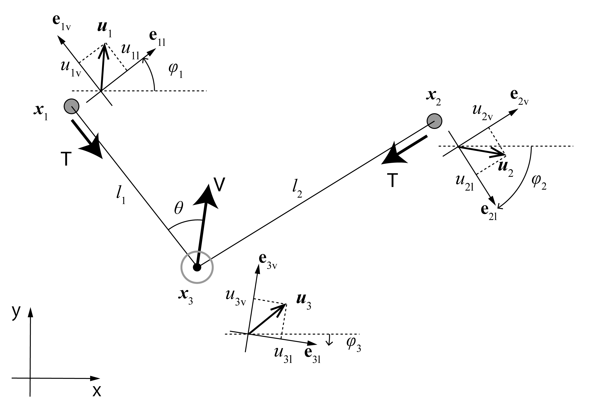

# 計算

## 1. 概要
そもそも、摩擦無し1ディアボロにおいて力学を考える際、何が未知で何を知りたいのか、整理してみます。まず物体は両手とディアボロの計3つですので、
これらの位置ベクトルを $\boldsymbol{x_1, x_2, x_3}$ とします。時間微分により速度 $ \boldsymbol{u_1, u_2, u_3}$ 、加速度 $ \boldsymbol{a_1, a_2, a_3} $ も定義します。これで合計9つのベクトル、平面なら18つの変数が定義されました。

$ \boldsymbol{x_1,x_2} $ は手の位置ですから、意思しだいで動かせます。必然的に $ \boldsymbol{u_1,u_2,a_1,a_2} $ も意思しだいです。
未知なのはディアボロに関する $ \boldsymbol{x_3, u_3, a_3} $ になります。$ \boldsymbol{u_3, x_3} $ については微分方程式を解くとして、問題になるのは $ \boldsymbol{a_3} $ です。
古典力学の流れに沿って、運動方程式と束縛条件を解くことにより、 $ \boldsymbol{a_3} $ を意思しだいの $ \boldsymbol{x_{1,2}, u_{1,2}, a_{1,2}} $ と、 $ \boldsymbol{x_3, u_3} $ も含め、16つかそれ以下の変数で表すことがゴールであると言えます。

$$
\begin{align}
m \boldsymbol{a}_{3} =  \boldsymbol{F}\left(\boldsymbol{x}_1, \boldsymbol{x}_2 , \boldsymbol{x}_3, \boldsymbol{u}_1, \boldsymbol{u}_2, \boldsymbol{u}_3 \right) \; (equations \; of \; motion) \\
f(\boldsymbol{x}_1, \boldsymbol{x}_2 , \boldsymbol{x}_3, L) = 0 \; (constraint) \\
\dot{f} = g(\boldsymbol{x}_1, \boldsymbol{x}_2 , \boldsymbol{x}_3, \boldsymbol{u}_1, \boldsymbol{u}_2, \boldsymbol{u}_3, L) = 0  \; (constraint) \\
\ddot{f} = h(\boldsymbol{x}_1, \boldsymbol{x}_2 , \boldsymbol{x}_3, \boldsymbol{u}_1, \boldsymbol{u}_2, \boldsymbol{u}_3, \boldsymbol{a}_1, \boldsymbol{a}_2 ,\boldsymbol{a}_3, L) = 0  \; (constraint)
\end{align}
$$

特に今回の系においては、ディアボロの質量mと紐の長さLが定数として与えられます。
運動方程式(1)がディアボロにかかる垂直抗力と重力について、束縛条件(2)及びその時間微分(3), (4)がL一定という条件について立式できます。
(1)を方向・大きさ既知の重力と方向既知大きさ未知の垂直抗力について書き表し、(2)を $ \boldsymbol{x_1-x_3} $ と $ \boldsymbol{x_2-x_3} $ の距離の合計がLとなるように書き表せば、あとは連立方程式を解くだけです。
ここで、垂直抗力の大きさが未知であるため、これについても解くことになります。

本質的にはこれで終了ですが、(2)で絶対値が出てくる時点で綺麗な解はあまり期待できません。
そこで、この記事で取り組む問題は、x, u, aの計18つの変数について、適当な変数の変換を行うことで、 $ \boldsymbol{a_3} $ の解を綺麗な式で表そうということになります。
詳しい式変形は次の章から行いますので、ここでは全体像を軽く説明します。

幸いなことにこれまでの記事で、等速楕円運動や垂直抗力や張力の向きについて強い制約があるとわかっているので、これらの知識にそって行けば自然に綺麗な解が得られると期待できます。具体的には、次のように値をおいていきます。

前回の記事でやったように、各物体についてl軸v軸を定義することを考えます。
今回はきちんとやるので、基底ベクトルeを図のように定義すると考えます。
これらはそれぞれ回転座標系をなします。
速度と加速度については、各回転座標系による成分表示
 $ u_{il}, u_{iv}, a_{il}, a_{iv} \: (i=1,2,3) $ を用いることにします。
$ l_1,l_2 $ を紐の各区分の長さ(x1-x3, x2-x3の距離)として置きます。
さらに、各回転座標の基準座標からの回転角を $ \phi_{1-3} $ と置き、Vと $ l_1 $ の成す角を $ \theta $ と置きます。
$ l $ の和をL, 差を $ \Delta l $ とおいてやれば、位置 $ \boldsymbol{x}_i $ は次の式(5)に挙げる6変数のセットで表せます。

$$
\begin{align}
(\boldsymbol{x}_{1}, \boldsymbol{x}_{2}, \boldsymbol{x}_{3}) &\Leftrightarrow (L, \Delta l, \phi_{3}, \theta, x_{3x}, x_{3y}) \dots \boldsymbol{X} \\
L &= L_0 \; (constraint)\\
(\phi_{3}, \theta), (\boldsymbol{u}_1, \boldsymbol{u}_2, \boldsymbol{u}_3) &\Leftrightarrow (\phi_{3}, \theta), (U_{l}, \Delta u_{l}, U_{v}, \Delta u_{v}, u_{3l}, u_{3v}) \dots \boldsymbol{U} \\
u_{3v} &= \frac{U_{v}}{\cos \theta} \; (constraint) \\
(\phi_{3}, \theta),  (\boldsymbol{a}_1, \boldsymbol{a}_2, \boldsymbol{a}_3) &\Leftrightarrow  (\phi_{3}, \theta), (A_{l}, \Delta a_{l}, A_{v}, \Delta a_{v}, a_{3l}, a_{3v}) \dots \boldsymbol{A} \\
a_{3v} &= a_{3v}(\Delta l , \theta , U_{l} , \Delta u_{l} , U_{v} , u_{3l}, A_{v}) \; (constraint)\\
\end{align}
$$

$ L, \Delta l, \phi_3, \theta, \boldsymbol{x}_3 $ が分かれば作図可能なことから、相互に変換可能とわかります。
さて、この一般的な意味での座標変換(5)を行うことで、束縛条件が非常にシンプルに、Lが定数 $ L_0 $ (6)と表せます。
もともと(2)が6変数の式だったことを考えると、偉大な成果です。

つづいて、速度は回転座標系での成分 $ u_l, u_v $ を用いるのですが、 $ \boldsymbol{u_1,u_2} $ について対称性を活かすため、
$ U_l=(u_{l1} + u_{l2})/2, \: \Delta u_l=(u_{l1} - u_{l2})/2 $ のように線形変換した値を用います。
こうすると諸々の式がさらに綺麗になります。
計算を行うと、一階微分の束縛条件がこれまた綺麗な式(8)になります。
一般式(3)は12変数の式で、式(2)を用いても11変数どまりだった点を考えると、なかなか上手くいきました。

最後に、加速度についても速度と同様に $ A_l, \Delta a_l $ などを定義して用います。
これにより計算すると、2階微分の束縛条件として $ a_3v $ が7変数の関数としてかなり綺麗に表せます(10)。

$$
\begin{align}
\boldsymbol{X}, \frac{d}{dt} (\Delta l, \phi_{3}, \theta, x_{3x}, x_{3y}) &\Leftrightarrow \boldsymbol{X}, (U_{l}, \Delta u_{l}, U_{v}, \Delta u_{v}, u_{3l}) \\
\boldsymbol{X}, \boldsymbol{U}, \frac{d}{dt} (U_{l}, \Delta u_{l}, U_{v}, \Delta u_{v}, u_{3l}) &\Leftrightarrow \boldsymbol{X}, \boldsymbol{U}, (A_{l}, \Delta a_{l}, A_{v}, \Delta a_{v}, a_{3l}) \\
ma_{3v}&= 2T\cos\theta - mg\cos\phi_{3} (equations \; of \; motion)\\
ma_{3l} &= -mg\sin\phi_{3} (equations \; of \; motion)\\
T \text{ is independent of:} \\
x_{3x}, x_{3y} &\dots Freedom \; of \; system \; displacement. \\
\Delta u_{v}, \Delta a_{v}, A_{l}, \Delta a_{l} &\dots Freedom \; of \; input. \\
a_{3l} &\dots Orthogonal \; to \; V. \\
a_{3v} \text{ is further independent of:} \\
\phi_{3} &\dots Freedom \; of \; system \; rotation.
\end{align}
$$

(5)を座標変換と捉えるならば、これらの位置変数の時間微分を速度・加速度として進めるのが、一般には自然なやりかたかもしれません。
しかし、 $ \boldsymbol{u_1, u_2, a_1, a_2} $ がプレイヤーからの入力である点を綺麗に反映させるため、
今回はそのようにはしていません。
ただし、(11),(12)のような相互変換は可能なので、特に問題ないかと思います。

最後に運動方程式を書くと、これまた綺麗な式になります(13,14)。
l方向に働く力は重力だけという知見を反映し、a3lは定数m,gと変数 $ \phi_3 $ だけで表せました。
$ a_{3v} $ は式(10)のように7変数関数で表せるので、張力Tについて(13)を解けば、 $ \phi_3 $ を加えて計8変数の式で表すことが出来ます。
そもそも変数が合計18個あり、束縛条件は3式だけだった点を考えると、合計7つもの変数がTに関与しないことになります。
(16)-(20)のように、これらの独立な変数がどのような自由度に由来するのか、考察することができます。
ここらへんは式変形を追ってから考えましょう。

## 2. 計算
まず、先ほどの図のように $ \phi_{1,2,3}, \theta $ を定義すると、 $ \phi_{1,2} $ と $ \phi_3,\theta $ は互いに線形に書くことができます(21)。
対称性を活かすため $ \phi_3,\theta $ を採用します。また、Lと $ \Delta l $ は(22)のように定義します。

$$
\begin{alignat}{3}
\theta &= \frac{\phi_{1} - \phi_{2}}{2} & &\;\;\; & \phi_{3} &= \frac{\phi_{1} + \phi_{2}}{2} \\
L &= l_{1} + l_{2} & &\;\;\; & \Delta l &= l_{1} - l_{2}
\end{alignat}
$$

ここで、 $ \theta, \phi $ について $ 2n\pi $ の任意性がある点が気になる人がいるかもしれませんが、
ひとまず図のようにディアボロが紐に乗ってる状態で自然にθ=0~π/2, φ=-π/2~π/2となるよう定義しましょう。

速度については、まずv,l軸成分である $ u_v, u_l $ をそれぞれ定義し、さらに $ \boldsymbol{u_1,u_2} $ については(23)(24)のように線形変換で $ U_{l,v}, \Delta u_{l,v} $ を定義して採用します。
これにより対称性を活かしていきます。単純に回転座標系に直して線形変換しただけなので、(7)の互換性は担保されます。

$$
\begin{alignat}{3}
U_{l} &= \frac{u_{1l} + u_{2l}}{2} & &\;\;\; & \Delta u_{l} &= \frac{u_{1l} - u_{2l}}{2} \\
U_{v} &= \frac{u_{1v} + u_{2v}}{2} & &\;\;\; & \Delta u_{v} &= \frac{u_{1v} - u_{2v}}{2} 
\end{alignat}
$$

束縛条件を考えましょう。まずl1とl2の和、つまりLが定数であることが第一の束縛条件です。

次にその微分を考えます。各物体の微小変位を考慮すると、(25)のようになることがわかります。
少し説明すると、物体1,2、すなわち両手のl方向の微小変位は、Lに対して2次の微小量しか変化を与えません。
一方で、v方向の微小変位は、直接そのままLに加算されます。
よって $ u_{1v},u_{2v} $ が項に入ってきます。
物体3, すなわちディアボロの微小変位は、l方向では $ l_2 $ に対して $ u_{3l} \sin \theta dt $ 、
$ l_1 $ に対して $ -u_{3l} \sin \theta dt $ の変化を与えるため、プラマイゼロになります。
一方v方向の微小変位は、それぞれに $ -u_{3v} \cos\theta dt $ の変化を与えるため、
これが項に入ってきます。

$$
\begin{align}
L = L_0 \Leftrightarrow u_{1v} + u_{2v} = u_{3v}\cdot 2 \cos\theta \\
\end{align}
$$

(24)と(25)を使えば、u3vについて(8)が導かれ、こいつは従属変数となり下がります。

さて、(11)の互換性の確認の一部として、下記のような計算が可能です。
( $ \theta \simeq \sin\theta \simeq \tan\theta $ )を念頭に微小変位を考慮することにより、
φ1とφ2の時間微分が導けます。
線形変換と諸々の変数変換により、φ3とθについて、時間微分を導くことができます。
またΔlの時間微分についても、微小変位を考えるとのように求まります。

$$
\begin{align}
\dot{\phi}_{1} &= \frac{1}{l_1} \left( -u_{1l} + u_{3l}\cos\theta + u_{3v} \sin\theta \right) \\
\dot{\phi}_{2} &= \frac{1}{l_2} \left( -u_{2l} + u_{3l}\cos\theta - u_{3v} \sin\theta \right) \\
\dot{\phi}_{3} &= \frac{\dot{\phi}_{1} + \dot{\phi}_{2}}{2} \\
&= \left( \frac{l_{2} + l_{1}}{2 l_{1}l_{2}} \right) \left( u_{3l} \cos\theta - \frac{u_{1l} + u_{2l}}{2} \right) + \left( \frac{l_{2} - l_{1}}{2 l_{1}l_{2}} \right) \left( \frac{\sin\theta}{\cos\theta} \frac{u_{1v}+u_{2v}}{2} - \frac{u_{1l} - u_{2l}}{2} \right) \\
&= \frac{2L}{L^{2}-\Delta l^{2}}\left(u_{3l}\cos \theta - \frac{u_{1l}+u_{2l}}{2} \right)+\frac{2\Delta l}{L^{2}-\Delta l^{2}} \left(\frac{u_{1l} - u_{2l}}{2} - \frac{\sin\theta}{\cos\theta} \frac{u_{1v} + u_{2v}}{2} \right) \\
&= \frac{2L}{L^{2}-\Delta l^{2}}\left(u_{3l}\cos \theta - U_{l} \right)+\frac{2\Delta l}{L^{2}-\Delta l^{2}} \left(\Delta u_{l} - \frac{\sin\theta}{\cos\theta} U_{v} \right) \\
&= \dot{\phi}_{3} \left(\Delta l , \theta , U_{l} , \Delta u_{l} , U_{v} , u_{3l} \right) \\
\dot{\theta} &= \frac{\dot{\phi}_{1} - \dot{\phi}_{2}}{2} \\
&= \left( \frac{l_{2} + l_{1}}{2 l_{1}l_{2}} \right) \left( \frac{\sin\theta}{\cos\theta} \frac{u_{1v}+u_{2v}}{2} - \frac{u_{1l} - u_{2l}}{2} \right)+ \left( \frac{l_{2} - l_{1}}{2 l_{1}l_{2}} \right) \left( u_{3l} \cos\theta - \frac{u_{1l} + u_{2l}}{2} \right) \\
&= \frac{2L}{L^{2}-\Delta l^{2}}\left( \frac{\sin\theta}{\cos\theta} \frac{u_{1v}+u_{2v}}{2} - \frac{u_{1l} - u_{2l}}{2} \right)+\frac{2\Delta l}{L^{2}-\Delta l^{2}} \left( \frac{u_{1l} + u_{2l}}{2} - u_{3l} \cos\theta \right) \\
&= \frac{2L}{L^{2}-\Delta l^{2}}\left( \frac{\sin\theta}{\cos\theta} U_{v} - \Delta u_{l} \right)+\frac{2\Delta l}{L^{2}-\Delta l^{2}} \left( U_{l} - u_{3l} \cos\theta \right) \\
&= \dot{\theta}\left(\Delta l , \theta , U_{l} , \Delta u_{l} , U_{v} , u_{3l} \right) \\
\Delta \dot{l} &= 2\left(u_{1v} + u_{2v} \right) + 2u_{3l}\sin \theta \\
&= 4\Delta u_{v} + 2u_{3l}\sin \theta \\
&=  \Delta \dot{l} \left(\theta , \Delta u_{v} , u_{3l} \right) \\
\dot{x}_{3x} &= u_{3l}\cos\phi_{3} - u_{3v}\sin\phi_{3} \\
&= u_{3l}\cos\phi_{3} - \frac{\sin\phi_{3}}{\cos\theta}U_{v} \\
&= x_{3x}(\phi_{3}, \theta, U_{v}, u_{3l}) \\
\dot{x}_{3y} &= u_{3v}\cos\phi_{3} + u_{3l}\sin\phi_{3} \\
&= u_{3l}\sin\phi_{3} - \frac{\cos\phi_{3}}{\cos\theta}U_{v} \\
&= x_{3x}(\phi_{3}, \theta, U_{v}, u_{3l})
\end{align}
$$

(11)の逆向きは以下になります。

$$
\begin{align}
u_{3l} &= \cos\phi_{3}\dot{x}_{3x} + \sin\phi_{3}\dot{x}_{3y} \\
&= u_{3l}(\phi_{3}, \dot{x}_{3x}, \dot{x}_{3y}) \\
U_{v} &= \cos\theta \left( \cos\phi_{3}\dot{x}_{3y} - \sin\phi_{3}\dot{x}_{3x} \right) \\
&= U_{v} (\phi_{3}, \theta, \dot{x}_{3x}, \dot{x}_{3y}) \\
\Delta u_{v} &= \frac{\Delta \dot{l}}{4} - \frac{u_{3l}\sin\theta}{2} \\
&= \frac{\Delta \dot{l}}{4} - \frac{(\cos\phi_{3}\dot{x}_{3x} + \sin\phi_{3}\dot{x}_{3y})\sin\theta}{2} \\
&= \Delta u_{v}(\phi_{3}, \theta, \Delta \dot{l}, \dot{x}_{3x}, \dot{x}_{3y}) \\
U_{l} &= \dot{x}_{3x}\cos\phi_{3}\cos\theta + \dot{x}_{3y}\sin\phi_{3}\cos\theta - \frac{L\dot{\phi}_{3} + \Delta l \dot{\theta}}{2} \\
&= U_l(\Delta l, \phi_{3}, \theta, \dot{\phi}_{3}, \dot{\theta}, \dot{x}_{3x}, \dot{x}_{3y}) \\
\Delta u_{l} &= \dot{x}_{3y}\cos\phi_{3}\sin\theta - \dot{x}_{3x}\sin\phi_{3}\sin\theta - \frac{\Delta l \dot{\phi}_{3} + L \dot{\theta}}{2} \\
&= \Delta u_{l}(\Delta l, \phi_{3}, \theta, \dot{\phi}_{3}, \dot{\theta}, \dot{x}_{3x}, \dot{x}_{3y})
\end{align}
$$

さて、次に加速度にいきますが、回転座標系での一般的な速度と加速度の関係として(58-61)を用いていきます。
たとえば速度のv成分の微分は、加速度のv成分の微分と、一致しないことに注意してください。

$$
\begin{align}
\boldsymbol{u} &= u_{l} \boldsymbol{e}_l + u_{v} \boldsymbol{e}_v \\
\boldsymbol{a} &= \dot{u}_{l} \boldsymbol{e}_{l} + \dot{u}_{v} \boldsymbol{e}_{v} + u_{l} \dot{\boldsymbol{e}}_{l} + u_{v} \dot{\boldsymbol{e}}_{v} \\
&= \left( \dot{u}_{l} - u_{v}\dot{\phi} \right) \boldsymbol{e}_{l} + \left( \dot{u}_{v} + u_{l} \dot{\phi} \right) \boldsymbol{e}_v \\
&= a_{l} \boldsymbol{e}_{l} + a_{v} \boldsymbol{e}_{v}
\end{align}
$$

速度のときとまったく同じように、 $ A_{v,l}, \Delta a_{v,l} $ を定義していきます。
(60,61)の関係を用いて、それぞれ(12)のような変換も示しました。 
$ \dot{\phi}_3, \dot{\theta} $ については、(32,37)のように表せることを承知の上で、そのままにしてあります。

$$
\begin{align}
A_{v} &= \frac{a_{1v} + a_{2v}}{2} 
= \frac{\dot{u}_{1v} + \dot{u}_{2v}}{2} + \frac{u_{1l} \dot{\phi}_{1} + u_{2l} \dot{\phi}_{2}}{2} 
= \dot{U}_{v} + U_{l}\dot{\phi}_{3} + \Delta u_{l} \dot{\theta} \\
A_{l} &= \frac{a_{1l} + a_{2l}}{2} 
= \frac{\dot{u}_{1l} + \dot{u}_{2l}}{2} - \frac{u_{1v} \dot{\phi}_{1} + u_{2v} \dot{\phi}_{2}}{2} 
= \dot{U}_{l} - U_{v}\dot{\phi}_{3} - \Delta u_{v} \dot{\theta} \\
\Delta a_{v} &= \frac{a_{1v} - a_{2v}}{2} 
= \frac{\dot{u}_{1v} - \dot{u}_{2v}}{2} + \frac{u_{1l} \dot{\phi}_{1} - u_{2l} \dot{\phi}_{2}}{2} 
= \Delta \dot{u}_{v} + U_{l}\dot{\theta} + \Delta u_{l} \dot{\phi}_{3} \\
\Delta a_{l} &= \frac{a_{1l} - a_{2l}}{2} 
= \frac{\dot{u}_{1l} - \dot{u}_{2l}}{2} - \frac{u_{1v} \dot{\phi}_{1} - u_{2v} \dot{\phi}_{2}}{2} 
= \Delta \dot{u}_{l} - U_{v}\dot{\theta} - \Delta u_{v} \dot{\phi}_{3} 
\end{align}
$$

さて、最後の束縛条件、2階微分について計算しましょう。まず回転座標系より

$$
\begin{align}
a_{3l} &= \dot{u}_{3l} + u_{3v}\dot{\phi}_{3} \\
a_{3v} &= \dot{u}_{3v} + u_{3l} \dot{\phi}_{3}
\end{align}
$$

次に、束縛条件をもう一度時間微分することにより

$$
\begin{align}
L = const. \Leftrightarrow u_{1v} + u_{2v} = u_{3v}\cdot 2 \cos\theta \\
then \; \; \dot{u}_{1v} + \dot{u}_{2v} = \dot{u}_{3v} \cdot 2\cos\theta - \left( u_{3v} \cdot 2\sin\theta \right)\dot{\theta}
\end{align}
$$

順次代入していくことで、ようやくメインの式が導かれます。

$$
\begin{alignat}{3}
a_{3v}
&= \frac{\dot{u}_{1v} + \dot{u}_{2v}}{2\cos\theta} &
&+ u_{3l}\dot{\phi}_3 &
&+ \frac{\left( u_{1v} + u_{2v} \right) \sin\theta}{2\cos^2\theta} \dot\theta \\
&= \frac{a_{1v} + a_{2v}}{2\cos{\theta}} &
&+ \left(u_{3l} - \frac{u_{1l}+u_{2l}}{2\cos{\theta}}\right)\dot{\phi}_3 &
&+ \frac{\boldsymbol{u}_2\cdot\boldsymbol{e}_{3l} - \boldsymbol{u}_1\cdot\boldsymbol{e}_{3l}}{2\cos^2\theta}\dot\theta \\
&= \frac{\dot{U}_{v}}{\cos \theta} &
&+ u_{3l}\dot{\phi}_{3} &
&+ \frac{U_{v} \sin\theta}{\cos ^{2} \theta} \dot{\theta} \\
&= \frac{A_{v}}{\cos \theta} &
&+ \left( u_{3l} - \frac{U_{l}}{\cos \theta} \right) \dot{\phi}_{3} &
&+ \frac{U_{v}\sin \theta - \Delta u_{l} \cos \theta }{\cos ^{2} \theta} \dot{\theta}
\end{alignat}
$$

いくつかの表示法で表してありますが、どれも似たようなもので、用途に応じて使い分けるべきかと思います。
$ \dot{\phi}_3 $ , 
$ \dot{\theta} $ 
については (32),(37) のように表せることを承知の上で、(73)の式が今回の変数設定では最も綺麗な式になっています。
$ a_{3v} $ 、すなわちディアボロの加速度という未知量の一成分が、運動方程式ではなく束縛条件から導かれるのは面白いですね。
ちなみに $ \dot{\phi}_3 , \dot{\theta} $ をちゃんとバラすと

$$
\begin{align}
a_{3v} 
&= 
\frac{A_{v}}{\cos\theta} + \frac{2L}{\cos\theta \left( L^2 - \Delta l^2 \right)}
\left[
\left(u_{3l}\cos \theta - U_{l} \right)^2 +
\left(
u_{3v} \sin \theta - \Delta u_{l} 
\right)^{2} - 2\frac{\Delta l}{L}
\left(u_{3l}\cos \theta - U_{l} \right)
\left( u_{3v} \sin \theta - \Delta u_{l} \right)
\right] \\
&=
\frac{A_{v}}{\cos\theta} + \frac{2L}{\cos\theta \left( L^2 - \Delta l^2 \right)}
\left[
\left( u'_{l} + u'_{v} \right)^{2}
-2\left( \frac{L+\Delta l}{L} \right) u'_{l} u'_{v}
\right] \\
u'_{l} &:= u_{3l}\cos\theta-U_{l} = \frac{L \dot{\phi}_{3} + \Delta l \dot{\theta}}{2}\\
u'_{v} &:= u_{3v}\sin\theta - \Delta u_{l} = \frac{\Delta l \dot{\phi}_{3} + L \dot{\theta}}{2}\\
\end{align}
$$

最後に運動方程式を書いていきます。

$$
\begin{align}
a_{3l} &= \dot{u}_{3l} - u_{3v} \dot{\phi}_{3} = - g\sin\phi_{3} \\
a_{3v} &= \dot{u}_{3v} + u_{3l} \dot{\phi}_{3} = \frac{2T\cos\theta}{m} - g\cdot \cos{\phi_3}
\end{align}
$$

まず(78)より、未知であった $ a_{3l} $ がわかります。
重力無視ならば、ディアボロにかかる力は垂直抗力のみとなるため、当然 $ a_{3l} $ は0です。
$ a_{3v} $ は束縛条件より分かっているため、組み合わせると $ \boldsymbol{a}_3 $ が求まり、
ディアボロの軌道が読めるようになりました。

また、未知量であった張力Tが求まります。

$$
\begin{align}
T &= \frac{mg\cos\phi_{3}}{2\cos\theta} + \frac{m}{2\cos\theta}
\left(
\frac{A_{v}}{\cos \theta} + \left( u_{3l} - \frac{U_{l}}{\cos \theta} \right) \dot{\phi}_{3}+ \frac{U_{v}\sin \theta - \Delta u_{l} \cos \theta }{\cos ^{2} \theta} \dot{\theta} 
\right) \\
\end{align}
$$

最後に、垂直抗力Vや仕事率Pなど、必要な物理量は適宜計算できます。結局a3vの式(51-54)が根幹をなしています。

$$
\begin{align}
V &= 2T\cos\theta \\
P_1 + P_2 &= 2U_{v}T = \frac{U_{v}mg\cos\phi_{3}}{\cos\theta} + \frac{U_{v}m}{\cos\theta}a_{3v} \\
P_3 &= (P_1 + P_2) - mg \left( u_{3v} \cos\phi_{3} + u_{3l} \sin\phi_{3}  \right) \\
\end{align}
$$

## 3. ディアボロの加速度の各項の意味
式(70-73)で $ a_{3v} $ について綺麗な関係式を得ましたが、単に変数の数が7つと少なく抑えられている点だけではなく、
ある程度の意味を持った3つの項に分離出来ている点においても綺麗な式です。

第一項は $ A_{v} $ という、手をv軸方向に引っ張る加速度の項になっています。
つまり、これは直接的に手でディアボロを引く強さを反映しています。
また、3つの項のなかで加速度を含む項はこれ一つだけです。
すなわち $ \boldsymbol{x, u} $ が与えられたある瞬間において、張力Tを調節できる要素はこの $ A_v $ だけです。
Tをあげるには $ A_v $ を大きくし、Tを下げるには $ A_v $ を下げます。

第二項は楕円運動に伴う中心力の項です。
(72)でわかりやすいですが、円運動における加速度そのまんまになっています。
(52,54)において追加されるU_lの項は、系全体の移動に対する補償の役割を担います。
慣性系の変換(u)→(u+α)について第二項が一定となるように、この項が働きます。
$ U_l=0 $ となるような慣性系を選べば、(70-73)で第二項は同じになります。
ちなみに式(71,73)は慣性系の変換について各項が不変です。

第三項は、手の開閉に伴う加速度です。
手を開いているとき、つまり $ U_v $ が正で $ \dot\theta $ も正であるような瞬間、
ディアボロはどんどん上方向に加速されます。
これは、手を閉じてθが小さい時には、ディアボロは手の移動距離とほぼ同じだけしか上昇しない一方、
手を開いてθが大きくなると、テコの原理の要領でわずかな両手の移動でディアボロが大きく上昇する点に由来します。
したがって、 $ U_v $ 一定で手を開いていくと、ディアボロはどんどん加速しながら上昇します。
この現象を反映したのが第三項です。

## 4. 自由度

(10)と(15-20)をもう一度見てみましょう。
$ a_{3v} $ およびTは、 $ \boldsymbol{x}_3 $ に非依存です。
これは、系の位置ベクトルを一様にずらしても、運動に変化がないことを反映しています。

また、 $ a_{3v} $ およびTは、 $ \Delta u_v, \Delta a_v, A_l, \Delta a_v $ に非依存です。
これらは全て大事な両手の運動ですが、その瞬間の張力Tには影響しません。
つまり、同じ張力Tをかけているとしても、これらの変数の分だけ異なった両手の動きが可能ということになります。
手の動きの自由度を反映していると言えます。

$ a_{3l} $ はTにも $ a_{3v} $ にも影響しませんが、
そもそも垂直抗力に直交するような座標の取り方をしているので、このような結果になっています。

最後に、 $ \phi_3 $ は $ a_{3v} $ に影響せず、Tには重力項でのみ影響します。
これは、系全体の回転(φ→φ+α)について、無重力化では運動が不変であることを反映しています。