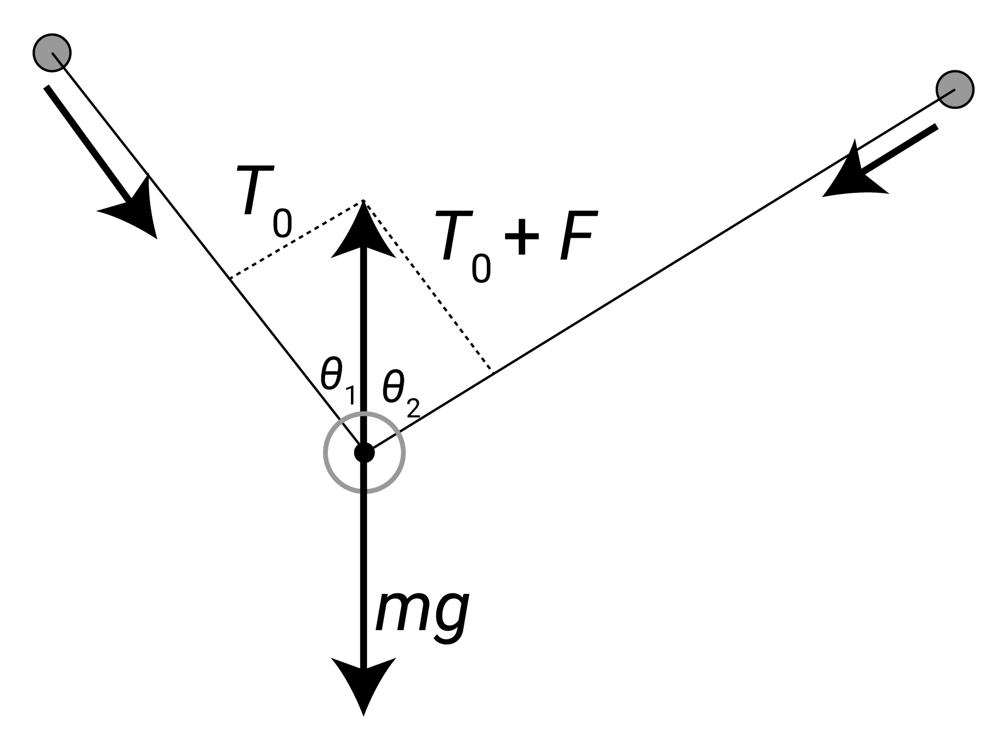

# 摩擦力

## 1 摩擦とは張力の差である

そもそも、ディアボロの運動における、摩擦の役割とはなんなのでしょうか。
摩擦がある場合と無い場合で、ディアボロにかかる力はどう変わるのでしょうか。
とりあえず、ディアボロの大きさを無視して、広い視野で見たときのことを考えます。

摩擦があろうとなかろうと成立する話として、重力を無視したときに系にかかる外力は、両手からの引っ張り力だけです。
そしてこれらは両側の張力に等しくなります。
すると、ディアボロに掛かる力は左右からの張力の和に等しくなります。
いま両手や紐の質量は無視しているので、系の重心の運動=ディアボロの運動になっている事がその理由です。

ポイントは、これが摩擦関係なしに成立する点です。
最初のほうの記事で垂直抗力を導入した際にも、張力のベクトル和が垂直抗力になるという話をしました。
これが摩擦ありの場合にも成立し、常に張力のベクトル和が、ディアボロに作用します。

では、摩擦の役割はなんなのか。
それは左右の張力に差を生み出すことです。
摩擦が極限に強い紐でエレベーターをやると想像してみると、下側の手を放してもディアボロは強い摩擦で空中に留まるでしょう。
この時、上側の紐はディアボロを支えるだけの張力を持っていますが、下側の紐はダルダルで張力はゼロになります。
このように、摩擦の存在下では張力に差が生まれます。

より詳しく説明すると、紐はディアボロからの摩擦力をうけますが、この摩擦力は性質上、常に紐と平行な方向を向きます。
紐の微小区間における力の均衡を考えたときに、張力に摩擦力が加算されることになり、張力の位置微分がノンゼロになります。

こうして、広い視野で見たときの摩擦力とは、張力の左右差と同じ意味であることが言えます。
張力に左右差が生まれる為、ディアボロに掛かる力の方向は、紐の角二等分線とはズレてきます。
この効果により、ディアボロの操作にさらなる自由度が与えられます。
ラップをしているときに、ディアボロを片方の手に「引き付ける」ような動きが可能なのは、角二等分線のルールが破れるためです。

さて、弱い側の張力を $ T_0 $ とし、強い側の張力には摩擦力Fを加算し、 $ T_0+F $ と書くことにしましょう。次に問題になるのは、摩擦力 $ F $ はどれくらいの大きさなのか、どうやって決まるのか、という話です。

## 2. 摩擦力と張力の比は基本的に道具固有。

さて、 $ F $ の大きさは、よりミクロな視点を持って、ディアボロの軸まわりでの微視的な力を考えると求められます。

軸に紐が巻き付いているとき、その巻き数を $ \theta_0 $ と置きます。ここで $ \theta_0 $ は、ラジアンを単位とします。
図のように一回ラップで紐が水平の場合は、 $ 2\pi $ になります。

軸と紐の接触点から角θだけ進んだ地点の、微小区間dθについて考えます(図中央)。
紐の張力をT(θ)としたとき、図のように考えて紐がうける垂直抗力dVは $ Td\theta $ になります。

ここで、近似にはなりますが、摩擦力が摩擦係数×垂直抗力で、比例の関係にあるとします。
実際には当然ズレてくるでしょうが、とりあえず摩擦係数をcで一定とします。
すると、微小領域でかかる摩擦力dFは、 $ c \times dV $ で簡単に求まります。摩擦力が張力変化の原因である点を考慮すると、dF=dT という関係が得られます。

あとはこれを積分形式に書きなおして、適当に微分方程式を解いてやれば、次のようにFが求まります。

$$
\begin{align}
T_{(\theta)} &= T_{0} + \int_{0}^{\theta}dF_{(\theta)}
= T_{0} + c\int_{0}^{\theta}T_{(\theta)}d\theta \\
S_{(\theta)} &:= \int_{0}^{\theta}T_{(\theta)}d\theta \\
\frac{d}{d\theta}S_{(\theta)} &= T_{0} + cS_{(\theta)} \\
T_{(\theta)} &= T_{0}e^{c\theta} \\
F &= T_{0} \left( e^{c\theta_{0}} -1 \right) \\
T'_0 &:= T_0 + F \\
\frac{T_0}{T'_0} &= e^{-c\theta_{0}} \\
\frac{F}{T'_0} &= \left( 1 - e^{-c\theta_{0}} \right)
\end{align}
$$

さて、結論となる式は(6,7,8)です。少し文字をおきなおして、T0とFの和、つまり強い側の張力をT0'とします(6)。
すると、左右の張力の比、T0/T0'は、摩擦係数cと巻き数θのみによって決まることがわかります(7)。ちなみにこれはキャプスタン方程式と呼ばれているらしいです。

これが意味するところは、手の動きによって張力の大きさ $ T_0 ' $ を変えることが出来ても、左右の張力の比は変えられない、したがってディアボロに掛かる力の向きは変えられない、ということです。
これらの比は、道具固有の摩擦係数と、巻き数のみによって変わります。

動摩擦力は、紐と軸表面の相対移動速度によって、右にも左にも働きます。加速方向・減速方向の話と同じです。
それゆえ、左右の張力の大小関係は、手の動きによって逆向きにすることが可能です。
よって上図のように逆方向の力もかけられます。

その上、実際には静止摩擦の状態あるいは左右の素早い切り替えによって、中間の力も実効的にはかけることができます。
したがってより正確には、ここで得られた張力比は、力の向きの上下限を表していると考えるべきでしょう。
どんな手の動かし方をしても張力比がこの範囲を超えることはなく、合成力の方向に範囲制限がかかる事になります。
(これより強い静止摩擦力を現実的にかけることは難しいという仮定)

## 3. ディアボロの摩擦力を覚えておこう
さて、張力比が指数関数的に減少するのも面白い発見です(式7)。グラフにすると、以下のようになります。

上記のように、横軸が摩擦係数cと巻き数θ0の積、縦軸がT0/T0'とすると、ただのexp(-x)のように減少します。
ある摩擦係数と巻き数が与えられたとき、定義より、グラフの下側が張力(強)のうち、張力(弱)T0の割合、上側が摩擦力Fの割合だと解釈できます。
例えば上図に示したように、 $ c\theta_0 = 0.4 $ 程度の状況では、張力には約30%の左右差が生じ、その30%分は摩擦力として消費されていると分かります。

摩擦が強い紐を用いたとき、cはだいたい0.2くらいになります。その時の0ラップ、1ラップ、2ラップでのcθ0を合わせてグラフに示しました。ここで0ラップの値が0でない理由は、ディアボロが普通に紐に乗っている状況を考えて、ラップ無しでも巻き数がπ/2程度あるとみなしているためです。
グラフをみればわかるように、ラップ無しでも左右の張力差は30%、かなり大きい値です。
さらに1回ラップすると、なんと張力の80%が摩擦力として消費されます。
摩擦力Fが回転加速を担うので、ラップによる加速効果はかなり大きいことがわかります。
同時に、ラップ時には減速方向の動作をすると極めて大きな回転減速が起こることも意味します。
2回ラップすると、張力(弱)は張力(強)のたったの5%程度、ほとんど片手でディアボロを支えていることになります。
一方で摩擦力は95%程度と大きいですが、これは1回ラップの80%と大差ありません。
摩擦の強い紐では、2回ラップによる加速効果はあまり見込めないと分かります。

摩擦の弱い紐を用いた場合には、cが減少してこれらの縦線の位置が左に動きます。
例えばc=0.1なら、0回ラップは横軸0.2、1回ラップは横軸0.8、2回ラップは横軸1.5くらいになります。
このときのT0%は、0ラップ→80%、1ラップ→40%、2ラップ→20%くらいになります。
とりわけラップ数の多い場合について、甚大な差が出ていることがわかります。
摩擦の小さな紐での2ラップは、摩擦の大きな紐での1ラップに相当すると予想できます。
もっと言えば、弱摩擦での3回ラップはT0%=10%程度になり、強摩擦での2回ラップよりも摩擦が少ないことになります。

以上のように摩擦係数が操作に与える影響は極めて大きく、とりわけラップ数が増えると甚大な差がでてきます。
摩擦の少ない紐を用いて2重ラップを利用した技をすることがありますが、以上のような背景があります。

## 4. 自分のディアボロの摩擦係数を測ろう

さて、摩擦力と垂直抗力の線形性を仮定として上記の議論を応用すると、摩擦係数の簡単な測定法があみだせます。
ディアボロを一回ラップして、両手を静止させ、ディアボロも静止した状態を考えましょう。ここでは右利きで、左側の張力が強いとします。

この時、上図のようにT0とT0+Fの合成力が、重力mgと釣り合っています。mgの大きさを知る事はできませんが、向きは鉛直下向きなので、合成力が鉛直上向きを向いていると分かります。
ここで、鉛直線と紐の成す角を $ \theta_1 , \theta_2 $ とすると、巻き数 $ \theta_0 $ や張力比 $ \frac{T_0}{T_0 + F} $ は以下のように表すことができます(9, 10)。
さらにcを $ \theta_1 , \theta_2 $ で表すことができます(11)。

$$
\begin{align}
\theta_0 &= 3\pi - (\theta_1 + \theta_2) \\
\frac{\sin\theta_1}{\sin\theta_2} &= \frac{T_0}{T_0 + F} = e^{-c\theta_0} \\
c &= \frac{1}{(3\pi - \theta_1 - \theta_2)} \log \left( \frac{\sin\theta_2}{\sin\theta_1} \right)
\end{align}
$$

さて、このような1ラップでの静止状態を、スマホのカメラで撮ってみます。
すると、鉛直線を自分で引けば、 $ \theta_1 , \theta_2 $ が画像から測定できますね。
パソコンに取り込んで適当なソフトでやってもいいし、スマホのアプリでも出来ると思います。
なんなら分度器でもいいと思います。筆者はパソコンでやりました。

後は式11に、測定した $ \theta_1 , \theta_2 $ の値を代入すると、cが求まります。単位がラジアンなので注意してください。

筆者が4回測定したところ、 $ \theta_1 $ は10-18度、 $ \theta_2 $ は54-74度くらいの範囲になり、摩擦係数cは0.17になりました(s.e.m.=0.014)。使用道具は第2世代のA-DREAMと使い古したRF1.6ホワイトです。体感では摩擦はやや強めで、似たような紐を使っている人はだいたい摩擦係数こんなもんだと思います。

写真の取り方によってかなり系統誤差が生じてしまうので、信頼しすぎるのは良くないと思いますが、量りなど器具を使わずに測定できるので、興味ある人は試してみてください。

若干面倒ですが、自分の好みの数値を測っておくと、道具を変えるときの参考になったり、本番に向けてコンディションを一定に保ったりするのに役立つかもしれません。

## 5. ディアボロの受ける力 - エレベーター

さて、上記の議論では、軸回りの力学から張力を導出し、さらにディアボロの受ける力を張力のベクトル和から求めていました。
一方で、ディアボロの受ける力を軸回りの力学から直接導出することも可能であり、それは張力のベクトル和と一致するはずです。

微視的には、ディアボロの受ける力は軸回りで紐から受ける垂直抗力と摩擦力の総和です。
張力が指数関数的に減衰する(式4)ことを踏まえると、ディアボロの受ける摩擦力 $ dF $ と垂直抗力 $ dV $ は下図のようになります。

巻き数を $ \theta_0 $ としてそれぞれの力の各成分は次のように表せます

$$
\begin{align}
F_y &= \int^{\theta_{0}}_{0}dF_{\theta}\cos\theta = \int^{\theta_{0}}_{0}cT_0 e^{c\theta}\cos\theta d\theta \\
F_x &= \int^{\theta_{0}}_{0}dF_{\theta}\sin\theta = \int^{\theta_{0}}_{0}cT_0 e^{c\theta}\sin\theta d\theta \\
V_y &= \int^{\theta_{0}}_{0}-dV_{\theta}\sin\theta = \int^{\theta_{0}}_{0}-T_0 e^{c\theta}\sin\theta d\theta \\
V_x &= \int^{\theta_{0}}_{0}dV_{\theta}\cos\theta = \int^{\theta_{0}}_{0}T_0 e^{c\theta}\cos\theta d\theta
\end{align}
$$

ちょっとトリッキーな積分ですがこれを解くと、

$$
\begin{align}
F_y &= T_0 \left[
\frac{c^2}{1+c^2} \left(e^{c\theta_0}\cos\theta_0 - 1 \right) + \frac{c}{1+c^2} e^{c\theta_0} \sin\theta_0 
\right] \\
F_x &= T_0 \left[
\frac{c^2}{1+c^2} e^{c\theta_0} \sin\theta_0 - \frac{c}{1+c^2}    \left(e^{c\theta_0}\cos\theta_0 - 1 \right)
\right] \\
V_y &= T_0 \left[- \frac{c}{1+c^2} e^{c\theta_0} \sin\theta_0 + \frac{1}{1+c^2} \left(e^{c\theta_0}\cos\theta_0 - 1 \right) \right] \\
V_x &= T_0 \left[ \frac{c}{1+c^2} \left(e^{c\theta_0}\cos\theta_0 - 1 \right) + \frac{1}{1+c^2} e^{c\theta_0} \sin\theta_0 \right] 
\end{align}
$$

したがってディアボロが受ける合計の力は、

$$
\begin{align}
F_y + V_y &= T_0 \left( e^{c\theta_0}\cos\theta_0 - 1 \right) \\
F_x + V_x &= T_0 e^{c\theta_0}\sin\theta_0
\end{align}
$$

となります。余談ですが、ディアボロにおいてcは普通1よりかなり小さいため、基本的には垂直抗力の寄与が支配的になります。

さて、摩擦力を利用した典型的な技、エレベーターの場合を考えてみましょう。単純に巻き数を1回転にすることで計算できます。

$$
\begin{align}
\theta_0 &= 2\pi \\
F_y &= T_0 \left[ \frac{c^2}{1+c^2} \left(e^{c2\pi} -1 \right) \right] \\
V_y &= T_0 \left[ \frac{1}{1+c^2} \left(e^{c2\pi} -1 \right) \right] \\
F_y + V_y &= T_0 \left( e^{c2\pi} -1 \right) = F \\
F_x &= - T_0 \left[ \frac{c}{1+c^2} \left( e^{c2\pi} -1 \right) \right] \\
V_x &= T_0 \left[ \frac{c}{1+c^2} \left( e^{c2\pi} -1 \right) \right] \\
F_x + V_x &= 0
\end{align}
$$

y軸方向に巨視的な摩擦力F (=張力差) の分だけ力を受け(25)、x軸方向には力を受けない(28)ことが確認できました。
張力差から求めたディアボロの受ける力と、軸回りの力学から求めたディアボロの受ける力が一致することが確認できました。
一般の巻き数 $ \theta_0 $ の場合にも、張力差Fを幾何学的にx,y成分に分解して式20, 21と比較すれば確認できます。(割愛)
