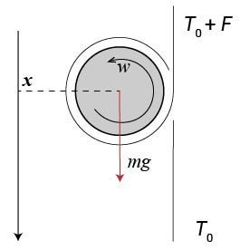

# ディアボロの回転

## 1. ディアボロの回転

ディアボロの回転の加減速を考えます。
以下、理想的にはディアボロは軸回りにのみ回転するので、そのような運動だけを考えます。
前回ディアボロにかかる微視的な力を計算した際に、軸が受ける摩擦力と垂直抗力がディアボロが受ける力の内訳であるとわかりました。
ディアボロは剛体であり、その重心運動は力の総和である張力差によって記述できますが、回転運動は軸が受けるトルクに支配されます。

軸が紐から受ける垂直抗力は常に回転中心に向かう方向であるため、軸回りのトルクNに寄与しません。
軸が受ける摩擦力は、常に軸表面に水平であるため、トルクNに寄与します。
軸半径をrとし、軸表面の微小区間 $ rd\theta $ における摩擦力 $ d\boldsymbol{T} $ のトルクへの寄与は

$$
\begin{align}
dN = \boldsymbol{r} \times d\boldsymbol{T} = rdT\\
\end{align}
$$

従って合計のトルクNは張力差 $ T_0' - T_0 = F $ を用いて

$$
\begin{align}
N = \int_{\theta = 0}^{\theta _0} rdT d\theta = rF
\end{align}
$$

このように、軸上での摩擦による張力損失がそのままトルクに寄与するため、張力差×軸半径がトルクに等しくなります。
ディアボロの慣性モーメントを $ I $ , 角速度を $ \omega $ とすると、剛体の基本的な性質により

$$
\begin{align}
I \dot{\omega} = N = rF
\end{align}
$$

これがディアボロの回転に関する基本的な式です。
しかし、ディアボロの回転運動を予測するときに重要なのは、角速度そのものではなく、軸表面の速度 $ w = r\omega $ です。
なぜなら、摩擦力は基本的に加速方向と減速方向の二種類しかありません。
そして紐と軸表面の相対速度、つまり $ \frac{\dot{\Delta l}}{2} $ と $ w $ の大小関係が、加速方向と減速方向を決定するためです。
従ってより使いやすい式は

$$
\begin{align}
\dot{w} = \frac{r^2 F}{I}
\end{align}
$$

さらに、Iやrの絶対値もさほど重要にはなりません。
結局必要になる情報は, ある摩擦力 $ F $ がかかった時にどれだけ $ w $ が変化するかです。
そこで $ I $ をディアボロの質量mを用いて次のように正規化します。

$$
\begin{align}
R := \frac{I}{mr^2} \\
\dot{w} = \frac{F}{mR}
\end{align}
$$

この正規化慣性モーメントRが、ディアボロの回転運動を特徴づける無次元量と言えます。
初歩的な剛体の力学からしても自然な定義だと思います。

## 2. 逆エレベーターによるRの測定

さて、Rが回転運動を特徴づけるといっても、具体的にどういう運動がRに依存するのでしょうか。
最も力学的に単純な例が、逆エレベーターです。

この技では、ディアボロを一回ラップした状態で、右手を上に左手を下にし、逆向きのエレベーターを行います。
ただしディアボロは回転がほとんど無い状態から(しばしば手で持った状態から)スタートします。
さらに、紐を強く張ることにより、ディアボロが滑り落ちることが無いようにします。
ディアボロは重力により下向きに加速しながら、また回転速度も上昇しながら、コロコロと下へ転がり落ちていきます。
スタート技などでやっている人をたまに見ます。

これは特徴的な運動で、理想的にはディアボロ紐の上を滑ることなく、静止摩擦力のみを受け続けます。
$ \frac{\dot{\Delta l}}{2} $ と $ w $ は常に同じ値を維持します。
動摩擦係数cは関係なくなり、従って、 $ T/T' \neq e^{-c\theta} $ という特殊な状況であることに注意。
剛体力学でよくある、ざらざらな坂道の上を転がる剛体のアナロジーと捉えることもできます。

さて、この運動を解析するため、まず重心運動の運動方程式をかきます。ディアボロの進行方向をx軸正方向とし、

$$
\begin{align}
m\ddot{x} = mg - F
\end{align}
$$

さらに静止条件より、

$$
\begin{align}
\dot{x} = w
\end{align}
$$

(5,6,7)の連立方程式を解くことにより、

$$
\begin{align}
\ddot{x} = \frac{1}{1+R} g
\end{align}
$$

よって、ディアボロは下向きの等加速度運動をすることがわかります。
そして、Rが大きいほどこの加速度は小さいということがわかります。
定性的にも、慣性モーメントがでかいディアボロは回転しづらいはずなので、あっています。

この加速度を動画解析などで求めて重力加速度と比較することにより、正規化慣性モーメントRを測定することができます。